# Plan: Kongeriget Thornmark – fuld beskrivelse (marker, len, herreder, borge)

## 1. Udgangspunkt og kilder

**Autoritative kilder (verificer alt her):**

- Landinddeling og navne: [Delt/Arkivet for Kongeriget Thornmark.md](Delt/Arkivet for Kongeriget Thornmark.md)
- Eksisterende områdebeskrivelser: [Områder/Dalhul Len/](Områder/Dalhul Len/) (Dalhulborg, Eiriksfæste, Grevskov Slot, lokalhistorie, encounter chance, vejrsystem)
- NPC-struktur og stil: [NPC/Dalhul Len/Østerdal Herred/](NPC/Dalhul Len/Østerdal Herred/) (Lensbaron Eirik, Lensgreve Otto, Dalhulby-NPC'er)
- Lore og verifikation: [.cursor/skills/edens-efterklang-lore/reference.md](.cursor/skills/edens-efterklang-lore/reference.md). **Lore reference.md opdateres undervejs** (se §6 og under hver fase).
- Historie, myter og lokalhistorie: [.cursor/skills/edens-efterklang-historie/reference.md](.cursor/skills/edens-efterklang-historie/reference.md). **Historie reference.md opdateres undervejs** (se §6 og under hver fase).

**Regler fra Arkivet (uændret):**

- **Mark:** 2–4 len, 800–1.200 km². Regeres af Hertug/Landsgreve/Markgreve.
- **Len:** 2–3 herreder, ~400 km². Regeres af lensgreve/greve.
- **Herred:** 3–10 borge, ~120–150 km². Regeres af greve/vicebaron.
- **Borg:** 5–40 km², typisk 3–4 timers gang på tværs. Regeres af lensbaron (bagom).

---

## 2. Nuværende tilstand (evidens fra Arkivet og Områder)

| Niveau       | Højmark                                                                                           | Grøndal                      | Skovfelt                  | Strandfælde                                              | Tågebjerg                    | Granitdal              |
| ------------ | ------------------------------------------------------------------------------------------------- | ---------------------------- | ------------------------- | -------------------------------------------------------- | ---------------------------- | ---------------------- |
| **Mark**     | Beskrevet (bjerg/miner, Hertug Waldemar)                                                          | 1 sætning (Hertuginde Freja) | 1 sætning (Grevinde Ylva) | 1 sætning (Landsgreve Henrik); Thornhavn/Thorngård nævnt | 1 sætning (Lensgreve Harald) | 1 sætning (Greve Ivar) |
| **Len**      | 4 len (Malmryg, Fjeldtop, Klippekløft, Dalhul)                                                    | **Ingen**                    | **Ingen**                 | **Ingen**                                                | **Ingen**                    | **Ingen**              |
| **Herreder** | Alle navngivet                                                                                    | **Ingen**                    | **Ingen**                 | **Ingen**                                                | **Ingen**                    | **Ingen**              |
| **Borge**    | Mangler under **Dybhule** og **Grotteskygge** (Klippekløft); mangler under **Vesterdal** (Dalhul) | **Ingen**                    | **Ingen**                 | **Ingen**                                                | **Ingen**                    | **Ingen**              |

**Højmark – hvad der allerede findes i Arkivet:**

- **Malmryg Len:** Jernbund (Smedeklippeborg, Dybborg, Sortflods Borg), Kobberdal (Grubeborg, Handelsfæstet), Sølvstrøm (Glittertind Borg, Måneskinsfæstet) – alle med korte beskrivelser.
- **Fjeldtop Len:** Stormvind (Vagttårnsborg, Isleborg), Skykløft (Huleportborg, Eremitfæstet) – korte beskrivelser.
- **Klippekløft Len:** Dybhule Herred og Grotteskygge Herred – **ingen borge navngivet**.
- **Dalhul Len:** Østerdal (Dalhulborg, Skyggekildeborg, Glimmerstedborg, Højklippeborg, Furefæsteborg, Egeskovborg + landsbyer); **Vesterdal Herred – ingen borge navngivet**.

**Bemærkning:** Tågebjerg Mark angives i Arkivet som regeret af "Lensgreve Harald" – samme navn som Klippekløft Len under Højmark. Afklaring: én person med to titler, eller to forskellige Haralds (evt. rette titel i Arkivet).

**Lauenmark Len:** Findes i [Områder/Lauenmark Len/](Områder/Lauenmark Len/) (vejrsystem) og i reference.md, men **står ikke under nogen mark** i Arkivets indholdsfortegnelse. Verifikation: enten placere under en mark i Arkivet eller notere som "ikke bekræftet i Arkivet".

**Lauenmark Len og Greve Roderik (lore fra session logs + DM Lore):**

- **Roderik** er **Greve i Lauenmark Len**, syd for Dalhul Len. Evidens: [Sessioner/Session Logs/Noter til Session 5, 6, 8, 9](Sessioner/Session Logs/) (Grev Roderiks hær, tabard med grønt felt og rød drage, angreb på Dalhulby under falsk ork-løgn, "Roderik rider snart", "Roderik betaler"); [Sessioner/Aske over Dalhulby/Aske over Dalhulby.md](Sessioner/Aske over Dalhulby/Aske over Dalhulby.md) (samme citater).
- **Besættelse og Dunkleriet:** Brugeren bekræfter: Roderik er **besat af den onde drage, der styres af Dunkleriet igennem spejlet**. Session logs (Noter til Session 8): "Dragen og Roderik er sandsynligvis manipuleret af Mesteren og Dunkleriet"; vagten nævner en "Mester" over Roderik. [DM Lore/Den Kosmiske Balance — Dunkleriets Sande Natur.md](DM Lore/Den Kosmiske Balance — Dunkleriets Sande Natur.md) (afsnit "Hvorfor netop Roderik?"): Roderik forføres af Dunkleriet gennem drømme og falsk profeti; han tror, han tjener Eden og skal finde Hjertets Segl; i virkeligheden er han Dunkleriets redskab. Spejlet (sommerhuset/templet) og dragen er omtalt i [Sessioner/Sommerhuset Level 3/Niveau 3_ Det Øverste Tempel.md](Sessioner/Sommerhuset Level 3/Niveau 3_ Det Øverste Tempel.md) (spejlet slæbt igennem, dragen brød ind, Vogteren af Tomheden).
- **Planens konsekvens:** Lauenmark Len skal i Arkivet have **Roderik som regent (Greve)**. NPC Roderik skal beskrives med: Lauenmark Len syd for Dalhul Len; besættelse af den onde drage; dragen styres af Dunkleriet igennem spejlet; reference til DM Lore og session logs. Ved udfyldning af Grøndal Mark (eller anden mark syd for Højmark) skal Lauenmark Len indgå under den mark med Roderik som greve.

---

## 3. Fase 1: Højmark færdig (kun i Arkivet)

**Mål:** Arkivet har komplet hierarki for hele Højmark med navne og korte beskrivelser for alle borge.

**3.1 Klippekløft Len – borge**

- **Dybhule Herred:** Tilføj 2–4 borge (navne + 1–3 sætninger hver). Len er beskrevet som "dybe kløfter" og Lensgreve Harald som bjergbestiger/strateg – borgene bør matche (f.eks. kløftkontrollør, grotteindgange, vagtposter).
- **Grotteskygge Herred:** Tilsvarende 2–4 borge. "Grotteskygge" antyder huler/grotter – borgene kan have grotteadgang, mørke ruter, eremitter/sælgende.

**3.2 Dalhul Len – Vesterdal Herred**

- Tilføj 3–6 borge (navne + korte beskrivelser). Vesterdal er "søsterherred" til Østerdal; kan have handel, skov, eller mere perifer karakter for at skelne fra Østerdal.

**3.3 (Valgfrit) Højmark som mark**

- Evt. én kort mark-beskrivelse øverst under Højmark (geografi, klima, trusler) hvis Arkivet kun har "Kendetegnet ved bjerglandskaber og miner. Hersker: Hertug Waldemar."

**Reference.md undervejs:** Efter Fase 1: (1) Opdater [.cursor/skills/edens-efterklang-lore/reference.md](.cursor/skills/edens-efterklang-lore/reference.md) tabellen "Delt/Arkivet" (evt. kort note om Højmark nu komplet med alle borge under Dybhule, Grotteskygge, Vesterdal). (2) Opdater [.cursor/skills/edens-efterklang-historie/reference.md](.cursor/skills/edens-efterklang-historie/reference.md) tabellen "Kongerige og adel" så den afspejler Arkivet (Højmark komplet med alle borge).

**Succeskriterie:** Søg i Arkivet efter "Dybhule", "Grotteskygge", "Vesterdal" – der skal stå mindst 2 borge under hver af de to første og 3+ under Vesterdal med navn og beskrivelse.

---

## 4. Fase 2: De fem øvrige marker – hierarki i Arkivet

**Mål:** For Grøndal, Skovfelt, Strandfælde, Tågebjerg og Granitdal skal der i Arkivet defineres:

- 2–4 len per mark (navne + regent + 1–2 sætninger),
- 2–3 herreder per len (navne + kort karakteristik),
- 3–10 borge per herred (navn + kort beskrivelse),

så Kong Eirik XV's rige har et komplet administrativt kort.

**Principper:**

- Navne og temaer skal bygge på den korte mark-beskrivelse og hersker (Freja, Ylva, Henrik, Harald, Ivar) og på eksisterende lore (Skabelsesberetning, Dunkleriet, grimdark tone). Ingen nye "fakta" der modsiger Delt/DM Lore.
- **Strandfælde Mark:** Thornhavn og Thorngård Slot skal indgå logisk (f.eks. som eget len eller som borg/hovedstad under et kystlen).
- **Lauenmark Len:** Skal indgå under en mark (fx Grøndal Mark – syd for højlandet, åbne marker) med **Greve Roderik** som regent. Roderik er besat af den onde drage, der styres af Dunkleriet igennem spejlet (session logs, DM Lore); hans hær (grøn/rød drage-tabard) har angrebet Dalhulby. Arkivet skal opdateres med Lauenmark Len og Roderik; NPC-fil for Roderik skal inkludere besættelse/drage/spejl/Dunkleriet.

**Forslag til omfang pr. mark (kan justeres):**

- Grøndal: 2–3 len (landbrug, floder, retfærdighed).
- Skovfelt: 2–3 len (skov, jagt, Ylva).
- Strandfælde: 2–4 len (kyst, handel, Thornhavn/Thorngård).
- Tågebjerg: 2–3 len (tåge, mystik, sagn).
- Granitdal: 2–3 len (stenbrud, stenhåndværk, Ivar).

**Reference.md undervejs:** Efter Fase 2: (1) Opdater [.cursor/skills/edens-efterklang-lore/reference.md](.cursor/skills/edens-efterklang-lore/reference.md) – tabellerne "Delt/Arkivet", "Områder" og "NPC'er" med alle nye marker, len, herreder, borge og filstier (inkl. Lauenmark Len, Greve Roderik, Grøndal/Skovfelt/Strandfælde/Tågebjerg/Granitdal); Verifikation kan udvides. (2) Opdater [.cursor/skills/edens-efterklang-historie/reference.md](.cursor/skills/edens-efterklang-historie/reference.md) – tabellen "Kongerige og adel" med alle nye marker/len/herreder/borge og regenter; evt. note under "Lokalhistorie" om at nye områder tilføjes i Fase 3.

**Succeskriterie:** Arkivet indeholder under hver af de 5 marker mindst 2 len; under hvert len mindst 2 herreder; under hvert herred mindst 3 borge, alle med navn og kort tekst.

---

## 5. Fase 3: Beskrivelser, NPC'er og historie

**5.1 Områder-filer (som Dalhul Len)**

- **Prioritet 1 – Højmark:** For de herreder/borge der mangler dybde: evt. korte Områder-filer (én pr. borg eller pr. herred) under `Områder/[Mark-navn] Len/` eller under eksisterende Højmark-len, i samme stil som [Områder/Dalhul Len/Dalhulborg/Dalhulborg i Østerdal Herred.md](Områder/Dalhul Len/Dalhulborg/Dalhulborg i Østerdal Herred.md) og [Dalhulborg – Lokalhistorie, Krige, Helte og Myter.md](Områder/Dalhul Len/Dalhulborg/Dalhulborg – Lokalhistorie, Krige, Helte og Myter.md).
- **Prioritet 2 – Øvrige marker:** Start med 1–2 "kerne-len" per mark (fx det len hvor hovedstaden/herskeren er) med områdebeskrivelse + evt. lokalhistorie. Resten kan være kortere eller kun i Arkivet til at starte med.

**5.2 NPC'er**

- Brug [.cursor/skills/npc-edens-efterklang/SKILL.md](.cursor/skills/npc-edens-efterklang/SKILL.md) og eksisterende NPC-struktur under [NPC/Dalhul Len/](NPC/Dalhul Len/).
- For hver mark: mindst herskeren (allerede navngivet i Arkivet) som NPC-fil, hvis ikke allerede oprettet.
- For hvert nyt len: lensgreve/greve som NPC (Evnepoint, Klasse & Niveau, Bopæl, Potentiel rolle).
- **Lauenmark Len – Greve Roderik:** Obligatorisk NPC-fil. Roderik er Greve i Lauenmark Len (syd for Dalhul Len); besat af den onde drage, der styres af Dunkleriet igennem spejlet. Kilder: [DM Lore/Den Kosmiske Balance — Dunkleriets Sande Natur.md](DM Lore/Den Kosmiske Balance — Dunkleriets Sande Natur.md) (Hvorfor netop Roderik?, Hjertets Segl, daggerten), Session logs 5–9 (Grev Roderiks hær, tabard, angreb på Dalhulby, Mesteren). NPC-skabelonen: antagonist/adel; inkluder Viden/Rivaler om Otto, Eirik, Dalhulby og spejlet/dragen.
- For udvalgte herreder/borge: 1–3 NPC'er pr. borg (lensbaron, købmand, præst, antagonist) hvor det giver mest spil.

**5.3 Historie**

- Korte "Lokalhistorie, Krige, Helte og Myter"-afsnit (som Dalhulborg) for 1–2 centrale borge/len per mark; resten kan nøjes med 2–3 sætninger i Arkivet.
- Tidsregning og tone: [Områder/Årstal og tidsregning i Edens Efterklang.md](Områder/Årstal og tidsregning i Edens Efterklang.md), grimdark, konsekvenser, ingen rene helte.

**5.4 Rivalerier og fejder**

- **Mål:** Beskrivelser af rivalerier og fejder mellem adelige (len, herreder, borge) så DM og spillere kan bruge dem som plot-hooks og konfliktkilde. Grimdark tone: ingen rene helte, konsekvenser, gamle sår.
- **Placering:** (1) I **Arkivet** – evt. et kort afsnit "Rivalerier og fejder i Thornmark" med oversigt (fx Otto vs. Eirik, Roderik vs. Otto/Eirik, mellem mark-herskere, mellem lensbaroner). (2) I **Lokalhistorie-filer** – udvid "Krige og stridigheder" med underafsnit "Rivalerier og fejder" hvor det giver mening (fx Dalhulborg har allerede Otto/Eirik/Magnus; Lauenmark/Roderik vs. Dalhul). (3) **NPC-filer** – feltet "Rivaler / Trusler" skal matche og krydsreferere til disse beskrivelser.
- **Eksisterende lore:** [NPC/Dalhul Len/Østerdal Herred/Dalhulborg/Lensbaron Eirik af Dalhulborg.md](NPC/Dalhul Len/Østerdal Herred/Dalhulborg/Lensbaron Eirik af Dalhulborg.md) nævner Otto, Magnus som rivaler; session logs og DM Lore har Roderik vs. Otto/Eirik. Byg videre derpå.
- **Succeskriterie:** Mindst én samlet oversigt (Arkivet eller separat fil under Delt) + rivalerier/fejder nævnt i mindst 2–3 Lokalhistorie-filer (fx Dalhulborg, Lauenmark) og konsistent med NPC Rivaler-felt.

**5.5 Stamtræer over adelige familier**

- **Mål:** Stamtræer (family trees) for de adelige familier i Thornmark, så slægtsforhold, arvefølge og konflikter kan verificeres og bruges i spil.
- **Placering:** Enten (a) et afsnit i **Arkivet** ("Adelige stamtræer") eller (b) en dedikeret fil under **Delt** (fx `Delt/Thornmark – Adelige stamtræer.md`). Format: tekst/markdown med indrykket hierarki eller enkel mermaid/ASCII-stamtræ; navn, titel, kort note (levende/afdød, regent fra år).
- **Omfang:** Mindst: **Kongefamilien** (Kong Eirik XV, dronning, børn – Prins Harald, Prinsesse Elena, Prinsesse Sofia ifølge lore); **Dalhul Len** – Lensgreve Otto af Grevskov, arving Arvid; **Dalhulborg** – Lensbaron Eirik (evt. ægtefælle, børn hvis nævnt); **Lauenmark Len** – Greve Roderik (evt. slægt). Udvid derefter til andre mark-herskere og centrale lensbaroner efter behov.
- **Kilder:** [Delt/Arkivet for Kongeriget Thornmark.md](Delt/Arkivet for Kongeriget Thornmark.md), [.cursor/skills/edens-efterklang-lore/SKILL.md](.cursor/skills/edens-efterklang-lore/SKILL.md) (Kong Eirik XV, Thornhavn), NPC-filer (Otto, Arvid, Eirik). Opfind ikke slægtsmedlemmer uden at notere "ikke bekræftet i materialet" eller knytte til eksisterende NPC/lore.
- **Succeskriterie:** Mindst kongefamilien + Otto/Arvid + Eirik (+ evt. Roderik) som stamtræ; fil eller Arkivet-afsnit med tydelig struktur; reference.md (lore + historie) opdateres med filsti til stamtræer.

**5.6 Ruiner, dungeons og monster-racer – placering og territorier**

- **Mål:** (1) Oversigt over **kendte ruiner og dungeons** og hvor de ligger (mark/len/herred/borge). (2) Oversigt over **områder hvor forskellige monster-racer hersker eller dominerer**, så rejser og wilderness har klare trusler og konfliktzoner.
- **Ruiner og dungeons – placering:** Samlet liste/tabel med: navn eller kort beskrivelse, placering (fx Mark → Len → Herred → Borg eller nær X), kilde (Arkivet, Lokalhistorie, sessioner). Eksisterende lore: [Delt/Skabelsesberetning og baggrund for Edens Efterklang.md](Delt/Skabelsesberetning og baggrund for Edens Efterklang.md) (ruiner og hulesystemer på verdensniveau); Arkivet – Furefæsteborg (gamle ruiner og mysteriøse stenformationer), Huleportborg (stor hule som lager/tilflugt); [Områder/Dalhul Len/Dalhulborg/Dalhulborg – Lokalhistorie, Krige, Helte og Myter.md](Områder/Dalhul Len/Dalhulborg/Dalhulborg – Lokalhistorie, Krige, Helte og Myter.md) (tunneler under Dalhulborg, Anden Tidsalder); Baron Eiriks sommerhus og Det Øverste Tempel (dungeon ved Hjertesøen/Dalhulborg). Nye ruiner/dungeons der tilføjes under Fase 1–2 (borge, herreder) skal indgå i oversigten. Placering: afsnit i Arkivet eller separat fil under Delt (fx `Delt/Thornmark – Ruiner og dungeons.md`).
- **Monster-racer – områder og herredømme:** Kort oversigt over **hvor hvilke monster-racer dominerer eller er en vedvarende trussel**: fx grå orker i bjergpassager (Jernbund Herred / Højmark – allerede i Arkivet), goblins i skovene (Dalhulborg omgivelser – encounter table), evt. pirater ved kysten (Strandfælde), andre humanoider ved grænser. Format: per mark eller per len – 1–3 sætninger med hovedtrusler og typiske væsener; kan stå i Arkivet under hver mark/len eller i en samlet tabel (fx `Delt/Thornmark – Monster-racer og trusler per region.md`). Byg på eksisterende: [Arkivet](Delt/Arkivet for Kongeriget Thornmark.md) (grå orker fra bjergpassager, orker og bjergtrusler ved Dybborg), [Encounter Chance Dalhulborg](Områder/Dalhul Len/Dalhulborg/Encounter Chance Dalhulborg.md) (goblins, ulve, blight-indikation). Grimdark: ingen rene “monsterlande” – gråzoner, konfliktzoner, områder hvor mennesker og racer kæmper om samme territorium.
- **Succeskriterie:** Mindst én oversigt med ruiner/dungeons inkl. placering (mark/len/herred eller nær X); mindst én oversigt med monster-racer/trusler per region (fx per mark). Reference.md (lore og/eller historie) opdateres med filsti til disse oversigter.

**Reference.md undervejs:** Efter Fase 3: (1) Opdater [.cursor/skills/edens-efterklang-lore/reference.md](.cursor/skills/edens-efterklang-lore/reference.md) med alle nye Områder-filer, NPC-filer, filsti til **adelige stamtræer**, og filsti til **ruiner/dungeons** samt **monster-racer per region** (Delt eller Arkivet); tabellerne "Områder" og "NPC'er" samt Verifikation afspejler den fulde Thornmark-struktur. (2) Opdater [.cursor/skills/edens-efterklang-historie/reference.md](.cursor/skills/edens-efterklang-historie/reference.md) – tabellerne "Lokalhistorie" og "Relaterede områdesfiler"; tilføj evt. række for **rivalerier/fejder**, **stamtræer**, **ruiner/dungeons** og **monster-racer/trusler**; Verifikation udvides.

**Succeskriterie:** 

- Mindst én Områder-fil og mindst én NPC-fil per mark (ud over Dalhul) som kan bruges til sessioner.
- **Rivalerier og fejder:** Mindst én oversigt (Arkivet eller Delt) + nævnt i 2–3 Lokalhistorie-filer; NPC Rivaler-felt konsistent.
- **Stamtræer:** Mindst kongefamilien + Otto/Arvid + Eirik (+ evt. Roderik) som stamtræ; fil eller Arkivet-afsnit; reference.md opdateret med filsti.
- **Ruiner og dungeons:** Mindst én oversigt med kendte ruiner/dungeons og placering (mark/len/herred eller nær X).
- **Monster-racer:** Mindst én oversigt med områder/trusler per region (fx per mark) – hvor hvilke racer hersker eller er hovedtrussel.
- Ingen nye steder/NPC'er uden referencer i Arkivet eller Delt/DM Lore; **begge reference.md** (lore + historie) **opdateres undervejs** (efter hver fase, se §6).

---

## 6. Filstruktur og reference

**Eksisterende mønster:**

- **Områder:** `Områder/[Len-navn]/[Borg eller tema].md` (evt. under mappe pr. herred).
- **NPC:** `NPC/[Len]/[Herred]/[Borg/]Navn – Rolle.md`.

**Nye marker/len:** Opret `Områder/[Len-navn]/` og `NPC/[Len]/[Herred]/` efter samme mønster. Mark-navn bruges ikke som mappenavn (len bruges); i Arkivet står mark som overskrift over len.

**reference.md (lore) – opdateres undervejs:** [.cursor/skills/edens-efterklang-lore/reference.md](.cursor/skills/edens-efterklang-lore/reference.md) skal opdateres **undervejs**: efter Fase 1 (Arkivet Højmark komplet), efter Fase 2 (alle marker/len/herreder/borge + Lauenmark/Roderik), og efter Fase 3 (nye Områder- og NPC-filer). Tabellerne "Delt/Arkivet", "Områder" og "NPC'er" samt evt. "Verifikation" udvides med nye filstier og steder.

**reference.md (historie) – opdateres undervejs:** [.cursor/skills/edens-efterklang-historie/reference.md](.cursor/skills/edens-efterklang-historie/reference.md) skal opdateres **undervejs**: efter Fase 1 (Kongerige og adel afspejler Højmark), efter Fase 2 (Kongerige og adel + alle nye marker/len/regenter; evt. note om kommende lokalhistorie), og efter Fase 3 (Lokalhistorie og Relaterede områdesfiler med nye Lokalhistorie-filer og områdesfiler for Thornmark). Så historie-skill altid kan verificere krige, helte og myter mod opdateret reference.

---

## 7. Rækkefølge og afhængigheder

```mermaid
flowchart LR
  subgraph fase1 [Fase 1]
    A1[Dybhule borge]
    A2[Grotteskygge borge]
    A3[Vesterdal borge]
  end
  subgraph fase2 [Fase 2]
    B1[Grøndal hierarki]
    B2[Skovfelt hierarki]
    B3[Strandfælde hierarki]
    B4[Tågebjerg hierarki]
    B5[Granitdal hierarki]
  end
  subgraph fase3 [Fase 3]
    C1[Områder-filer]
    C2[NPC-filer]
    C3[Historie]
    C4[Rivalerier og fejder]
    C5[Adelige stamtræer]
    C6[Ruiner dungeons og monster-racer]
  end
  fase1 --> fase2
  fase2 --> fase3
```

- **Fase 1** kan gøres først (kun redigering af Arkivet).
- **Fase 2** kræver at alle navne og herskere for de 5 marker står fast; Thornhavn/Lauenmark afklares her.
- **Fase 3** bygger på det færdige hierarki og kan prioriteres (fx start med Strandfælde pga. Thornhavn, eller med det len spillere først kommer til).

---

## 8. Ikke i scope

- Ændring af adelstitel-rangorden eller landinddelingsregler i Arkivet.
- Nye magi-regler eller racer ud over det der står i Skabelsesberetning/DM Lore.
- Session-logs eller spillerkort.
- Kort (ASCII eller billeder) – kan tilføjes senere ud fra de nye stedsnavne.

---

## 9. Afklaringer før implementering

1. **Lauenmark Len:** Skal indgå i Arkivet under en mark (anbefaling: Grøndal Mark) med **Greve Roderik** som regent. Roderik er besat af den onde drage, der styres af Dunkleriet igennem spejlet (session logs, DM Lore). Afklaring: Under hvilken mark skal Lauenmark Len ligge – Grøndal eller andet?
2. **Tågebjerg – Lensgreve Harald:** Bevidst samme navn som Klippekløft Len, eller skal Tågebjerg have en anden regent (fx andet navn/titel)?
3. **Omfang Fase 3:** Ønsker du fuld Områder + NPC + historie for **alle** nye borge, eller "fuld pakke" kun for 1–2 len per mark og resten kun med Arkivet-tekst?
4. **Strandfælde:** Skal Thornhavn/Thorngård være eget len, eget herred, eller én borg under et kystlen?
5. **Rivalerier/fejder:** Skal oversigten ligge i Arkivet (som afsnit) eller i en separat fil under Delt (fx `Delt/Thornmark – Rivalerier og fejder.md`)?
6. **Stamtræer:** Skal adelige stamtræer ligge i Arkivet (som afsnit) eller i en separat fil under Delt (fx `Delt/Thornmark – Adelige stamtræer.md`)? (Separat fil gør det nemmere at opdatere uden at ændre den store Arkivet-fil.)
7. **Ruiner/dungeons og monster-racer:** Skal oversigterne ligge i Arkivet (som afsnit) eller i separate filer under Delt (fx `Delt/Thornmark – Ruiner og dungeons.md`, `Delt/Thornmark – Monster-racer og trusler per region.md`)?

---

## 10. Overvejelser – hvad kan gøre Thornmark endnu mere komplet (BECMI)

Planen dækker allerede: landinddeling (mark → len → herred → borg), regenter, NPC'er, lokalhistorie, rivalerier/fejder, stamtræer, lore og reference-filer. For en **fuld BECMI-kampagneverden** kan følgende **valgfrie udvidelser** overvejes (ikke med i nuværende scope, men naturlige næste skridt):

- **Encounter-tabeller per region:** I dag findes [Områder/Dalhul Len/Dalhulborg/Encounter Chance Dalhulborg.md](Områder/Dalhul Len/Dalhulborg/Encounter Chance Dalhulborg.md). Tilsvarende encounter-guidelines per mark/len supplerer **monster-racer/trusler per region** (5.6) med konkrete tærnings-tabeller til wilderness-rejser.
- **Religion og kultsteder:** Verdenen har Eden, Dunkleriet, "De Eviges Rige" (cleric-magi), og lokalhistorie nævner "kulter". En kort oversigt over **hvor der er templer/kirker/kultsteder** (fx per len eller per mark), og hvem der tjener hvad (Eden, lokale helte, hemmelige Dunkleriet-kulter), understøtter cleric-backgrounds og plot-hooks. Kan være et afsnit i Arkivet eller i Lokalhistorie-filer.
- **Økonomi og handel (kort):** Hovedvarer per region (jern/kobber/sølv i Højmark, korn i Grøndal, tømmer i Skovfelt, havhandel i Strandfælde osv.) og evt. **markedsdage** eller **handelsruter** (1–2 sætninger per len) giver grundlag for rejse-eventyr og købmands-NPC'er. Kan indarbejdes i de eksisterende mark-/len-beskrivelser i Arkivet.
- **Militær og garnisoner:** Hvem har tropper hvor (kongens hær, lensgrevers hære, Roderiks hær) – kort oversigt understøtter krigs- og intrige-plots og er delvist dækket af rivalerier/fejder og NPC'er. Evt. 1–2 sætninger per len i Arkivet eller i rivalerier-filen.
- **Årlige begivenheder og fester:** Forårsjævndøgn i Dalhulby og høstfestival i Ovredalhulby findes allerede. Udvidelse med **markedsdage, pilgrimsfærd eller lokale fester** per region (fx per borg eller herred) giver hooks til rejser og sociale encounter. Kan stå i Lokalhistorie eller Arkivet.
- **Kort:** Allerede noteret i §8 som "kan tilføjes senere". Når alle stedsnavne er fastlagt, kan et overblikskort (ASCII eller billede) over Thornmark og evt. per mark/len tilføjes.

**Konklusion:** Planen leverer et **administrativt og narrativt komplet** kongerige (steder, folk, historie, konflikter, slægter). De ovenstående punkter er **nice-to-have** for endnu mere spilklar BECMI-verden; de kan tilføjes i en senere fase eller under implementering hvis tid er.