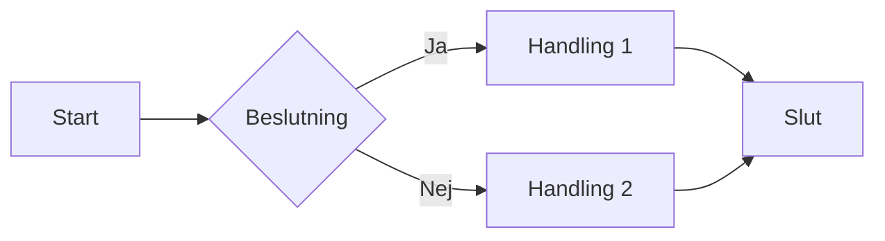
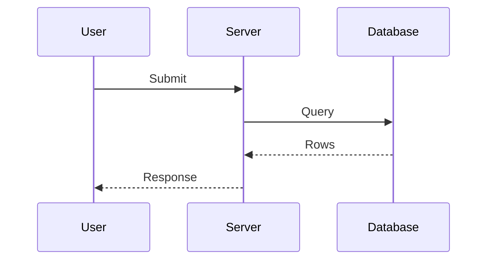
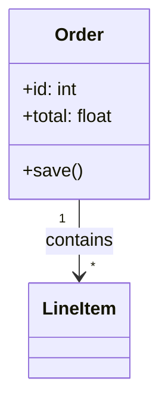
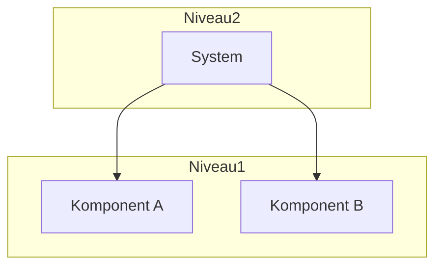
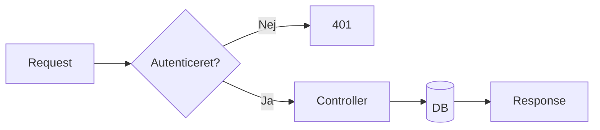
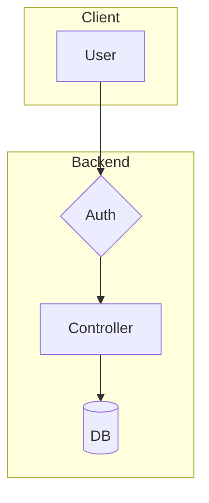
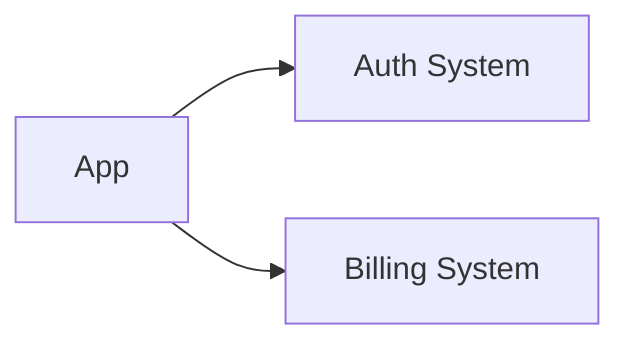

# Mermaid-diagrammer – Ekspertniveau

Du er ekspert i at generere og forbedre **Mermaid-diagrammer** direkte i Cursor. Diagrammer bruges til at vise logik, dataflow, arkitektur og struktur. Mermaid rendres i Markdown (med passende extension) og understøttes af Cursor.

---

## Når du bruger denne skill

- Brugeren beder om **diagram**, **flow**, **flowchart**, **sekvens**, **arkitektur**, **systemkort**, **datalinje** eller **visualisering**
- Brugeren nævner **Mermaid** eksplicit
- Opgaver som: "Vis hvordan requests går fra controller til database", "Spor denne variabel fra ind til ud", "Giv et komponent-overblik over denne service"
- Behov for **flow control**, **data lineage** eller **struktur** i kodebase eller design

---

## To dimensioner at overveje

1. **Formål:** Kortlægger du logik, dataflow, infrastruktur eller noget andet?
2. **Format:** Hurtigt (Mermaid) vs. mere formelt (fx UML) – denne skill fokuserer på Mermaid.

---

## Diagramtyper – hvornår hvad

| Behov | Mermaid-type | Brug til |
|-------|----------------|----------|
| Logik, beslutninger, flow | `flowchart` eller `graph TD` | Trin-for-trin, forgreninger, tilstande |
| Interaktion mellem parter | `sequenceDiagram` | Request/response, API-kald, bruger ↔ system |
| Objekt-/klassestruktur | `classDiagram` | Klasser, relationer, attributter |
| Enkel retningsgraf | `graph TD` / `graph LR` | Overblik, højniveau, få noder |

**Hurtig valg:**  
- "Hvordan flyder data?" → flowchart eller sequenceDiagram  
- "Hvem kalder hvem?" → sequenceDiagram  
- "Hvilke dele findes?" → graph eller classDiagram  

---

## Strategi: Start småt, byg op (C4-inspireret)

1. **Start lavt:** Vælg én funktion, én route eller én proces.
2. **Diagram den del** i Mermaid.
3. **Opsummer** til et mellemniveau (fx én service eller ét lag).
4. **Gentag** indtil ønsket abstraktionsniveau.
5. **Kombiner** til ét overbliksdiameter eller systemkort, hvis brugeren ønsker det.

Undgå at mappe "alt på én gang". Bedre: flere små, præcise diagrammer der kan slås sammen.

---

## Syntaks – kort reference

### Flowchart / graph

- Retning: `TB` (top-bottom), `LR` (left-right), `BT`, `RL`
- Noder: `[firkant]`, `(rund)`, `{rombe}`, `[(database)]`, `[[subroutine]]`
- Kant: `-->`, `-.->`, `==>`, `-- "tekst" -->`

### Sequence diagram

- `->>` solid, `-->>` stipled
- `participant`, `actor`, `note right of A: tekst`, `alt/else`, `loop`

### Class diagram

- Relationer: `-->`, `<--`, `--*`, `--o`, `||--||`

### Graph (simpel)

- `subgraph` til gruppering og lag (C4-style).

---

## Prompt-tips til brugeren

Anbefal at brugeren kan sige fx:

- **Flow:** "Vis hvordan requests går fra controller til database."
- **Data:** "Spor denne variabel fra hvor den kommer ind til hvor den ender."
- **Struktur:** "Giv et komponent-overblik over denne service."
- **Kombination:** "Lav først et detaljeret flow for login, så et højniveau-overblik over hele auth."

---

## Kvalitet og sti

1. **Unikke, læsbare ID'er:** Brug korte id'er (A, B, Server, DB) og vis fuld tekst i node-labels: `S[Server]`.
2. **Konsekvent retning:** Vælg én hovedretning (typisk TD eller LR) og hold den.
3. **Subgraphs for lag:** Brug `subgraph` til at vise niveauer (lav / mellem / høj) i samme diagram.
4. **Ét fokus per diagram:** Ét flow, én sekvens eller én struktur – undgå at proppe alt sammen.
5. **Markdown-blok:** Altid output som markdown code block med sproget `mermaid`, så preview (fx Mermaid-extension) kan rendre det.

---

## Eksempel: fra detalje til overblik

**Trin 1 – lavniveau (ét flow):**

**Trin 2 – indarbejd i mellemniveau med subgraph:**

**Trin 3 – højniveau (kan kombineres med andre moduler):**

---

## Extension

Brugeren kan installere **Markdown Mermaid**-extension i Cursor til at forhåndsvisning af diagrammer direkte i Markdown.

---

## Opsummering

- Vælg diagramtype ud fra **formål** (flow, sekvens, struktur).
- **Start småt** – én proces eller ét lag – byg derefter op og kombiner.
- Brug **subgraph** til lag og grupper; hold **ét fokus** per diagram.
- Output altid i en **mermaid** code block, med læsbare labels og konsekvent retning.
