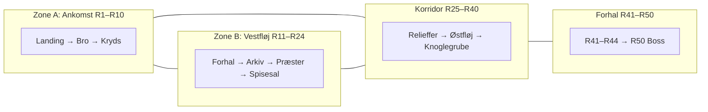
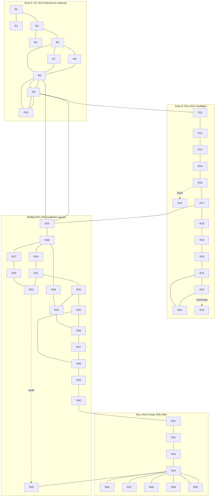

## ***Lensbaron Eiriks Sommerhus \- Niveau 3***

# **Niveau 3: Det Øverste Tempel**

---

### **DM-OVERSIGT: XP-BUDGET, SKAT OG OVERLEVELSE**

*(Denne sektion er kun for DM – aldrig vis den til spillerne.)*

**Mål:** 3 karakterer på Level 3 skal kunne stige til Level 4 (4.000 XP per karakter = **12.000 XP total**).

**Rum-billeder:** Ét billede per rum (R01–R50) er genereret: underjordisk tempel, 15–20 m under jorden, ingen væg-fakler, hvid/grå/sort marmor, kun fakkellys. Se `Sessioner/Sommerhuset Level 3/Images/README_Rum-billeder.md` for filiste og placering (Cursor assets-mappe). Kan kopieres til Images-mappen for brug i sessioner.

---

#### **XP-OVERSIGT (Ny skat + monster + sub-plots)**

| Kilde | Rum | gp-værdi / XP |
|-------|-----|---------------|
| **ZONE A – Ankomsten** | | |
| Gnoll-sergentens gemte bytte | R3 | 180 gp |
| Ofringsgaver i slimpølen | R9 | 395 gp |
| Gnoll-lair (skat) | R10 | 397 gp |
| Gnoll-lair (monstre, avg 7 gnoller + sergent) | R10 | ~140 XP |
| **ZONE B – Vestfløjen** | | |
| Potion of Healing (eksist.) | R12 | ~50 XP |
| Undead-krypt (skat) | R18 | 385 gp |
| Undead-krypt (Ring +1) | R18 | ~1.000 XP |
| Undead-krypt (Scroll, 2 spells) | R18 | ~200 XP |
| Undead-krypt (monstre) | R18 | ~80 XP |
| Shadows (eksist.) | R18 | ~50 XP |
| Skat under stenbordene | R20 | 275 gp |
| Spyd +1 (eksist.) | R21 | ~500 XP |
| Aquarins Prøve (sub-plot) | R23 | ~100 XP |
| Tempelpræstens nødcache | R25 | 375 gp |
| Præstens skriverbræt (sub-plot) | R17 | ~75 XP |
| Svends feltdagbog (sub-plot) | R12 | ~100 XP |
| **ZONE C – Østfløjen** | | |
| Skelet-eventyrer (opgraderet) | R29 | 280 gp |
| Jernhåndens feltmærke (sub-plot) | R30 | ~50 XP |
| Svampeskoven (sub-plot: Skrik) | R34 | ~100 XP |
| Ceremonielle dragter (opgraderet) | R35 | 525 gp |
| Knoglegruben (skat) | R37 | 325 gp |
| Knoglegruben (Potion of Speed) | R37 | ~250 XP |
| Ghouls (eksist.) | R37 | ~75 XP |
| Gnoll-shamanens ritual (sub-plot) | R10 | ~50 XP |
| **ZONE D – Det Tomme Fængsel** | | |
| Spejlets efterladte rester | R44 | 750 gp |
| Rune-plade (minor magisk) | R44 | ~150 XP |
| Vogterkammerets depot | R50 | 725 gp |
| Sword +1 | R50 | ~1.000 XP |
| Potion of Extra Healing | R50 | ~250 XP |
| Vogteren af Tomheden (monster) | R50 | ~175 XP |
| Spejlets aftryk (sub-plot) | R50 | ~150 XP |
| Wandering monsters (est. 4-6 encounters) | diverse | ~300 XP |
| **Øvrige sub-plot XP** | diverse | ~400 XP |

---

**TOTALER:**

| Kategori | Værdi |
|----------|-------|
| **Skat (gp = XP)** | ~4.612 gp |
| **Monster-XP** | ~870 XP |
| **Magiske genstande (XP)** | ~3.400 XP |
| **Sub-plot/lore XP** | ~1.075 XP |
| **Wandering monsters** | ~300 XP |
| **GRAND TOTAL** | **~10.257 XP** |
| **Per karakter (3 stk)** | **~3.419 XP** |

**Bemærk:** Ikke alt skat bliver fundet. BECMI-konventionen er, at spillere typisk finder 60-80% af skjult skat. Med fuld grundighed (og Skrik som guide) kan de nå 90%+. Desuden:
- Wandering monsters er konservativt estimeret. 2-5 dage i dungeon = flere encounters.
- Magiske genstande (Ring +1, Sword +1) giver stor XP ved fund. DM bestemmer, om XP gives ved *fund* eller ved *identifikation*.
- Hvis spillerne mangler ~500-1.000 XP for level 4, kan DM tilføje 1-2 ekstra wandering monster encounters eller øge wandering-skat lidt.

**KONKLUSION:** Med rimelig grundighed når spillerne **3.000-4.000 XP per karakter**, hvilket er tilstrækkeligt til Level 4. Den øvre grænse (4.000+) kræver, at de finder de fleste skjulte skatte OG renser undead-krypten.

**Aktuel stand (Session 13):** Spillerne står i **R10 (Hvilepladsen)** og har slået lejr der. **Gnollerne er IKKE i rummet fra start** – partiet er allerede der. Gnollerne **ankommer** (vender tilbage) i starten af sessionen fra nord (R9). Brug **kun** R10 under "VARIANT: Session 13" for åbnings-scene, antal, overraskelse og read-aloud. Se også `Sessioner/Session Logs/Noter til Session 13.md`.

---

#### **OVERLEVELSE: Mad & Vand (2-5 dages ophold)**

| Ressource | Rum | Kapacitet |
|-----------|-----|-----------|
| **VAND** | | |
| Aquarins Fontæne (rent vand) | R11 | 6 vandskin/dag (aktivering krævet) |
| Skjult cisterne | R26 | 3 liter/dag (nødforsyning) |
| Kondensvand fra svampe | R34 | 1-2 vandskin/time |
| Gnoll-lair vandskin | R10 | 2 vandskin (engangsfund) |
| **MAD** | | |
| Gnoll-rationer | R10 | 10 dages rationer (usmagelige) |
| Spiselige svampe | R34 | 4-6 personers daglige behov (uudtømmeligt) |
| Tempelforsyninger (tørrede) | R16/R19 | ~5 gode + ~10 halvdårlige portioner |

**Konklusion:** Med fontæne + svampe + gnoll-rationer kan 3-4 karakterer overleve **mindst 5 dage** komfortabelt. Uden fontæne-aktivering er vand den kritiske faktor – spillerne MÅ finde R26 eller R34-kondens.

---

#### **MAGISKE GENSTANDE (komplet liste)**

| Genstand | Rum | XP-værdi |
|----------|-----|----------|
| Potion of Healing (×2) | R10, R12 | ~100 XP |
| Potion of Speed | R37 | ~250 XP |
| Potion of Extra Healing | R50 | ~250 XP |
| Spyd +1 | R21 | ~500 XP |
| Short Sword +1 (Etherions Klinge) | R50 | ~1.000 XP |
| Ring of Protection +1 | R18 | ~1.000 XP |
| Scroll: Cure Light Wounds + Bless | R18 | ~200 XP |
| Scroll of Light | R35 | ~100 XP |
| Guld-rune-plade (+1 Save vs. Spells nær Spejlet) | R44 | ~150 XP |
| 6 doser hellig røgelse (Turn Undead +2) | R35 | brugsgenstand |

---

# **Wandering monsters**

(Tjek for et møde: 1-i-6 chance én gang i timen. Regler for Møder: side 101 i Rules Cyclopedia)

**Terninger:** Tabellen bruger kun **1d20** (ingen d24). Antal i rækkerne bruger d2, d3, d4, d6, d8, d10, d12, d20 – alt kompatibelt med d2/d3/d4/d6/d8/d10/d12/d20/d50/d100.

**Variation:** Brug **1d20** for bred variation. Zone kan justere sandsynlighed (se nedenfor) eller DM vælger passende slag efter område.

---

### **Hovedtabel: 1d20**

| SLAG | ENCOUNTER | ANTAL / BEMÆRKNINGER |
| ----- | ----- | ----- |
| **1** | **Gnolls (patrol)** | 2d4+2 Gnolls; i Zone A: +1 Gnoll Sergeant (HD 3). Ved slag 1: én bærer Jernhåndens sten-amulet (Sub-plot D). |
| **2** | **Gnolls (scouts)** | 1d4 Gnolls, forsigtige – de vil helst rapportere end kæmpe. Morale 6. Kan trække mod R9/R10. |
| **3** | **Ghouls** | 1d4+1. Ofte nær knogler eller mørke kroge. Lamme stadig farlig. |
| **4** | **Gray Ooze** | 1d2. I Zone C/svampenær: kan "dryppe" fra loft eller krybe fra en revne. Metal + nærkamp = risiko. |
| **5** | **Stirges** | 2d4. Flok fra et rede i en sprække. Fæstning = prioritet; flere fæstninger hurtigt. |
| **6** | **Shadows** | 2. Styrke-drain, immun mod normale våben. Kun i Zone B/C eller nær R18 – "præsternes korrupte ånder". |
| **7** | **Giant Rats** | 1d4+1 normal, eller 2 normal + 1 Alpha (HD 2, +2 skade). Æder affald eller lig; aggressive ved forstyrrelse. |
| **8** | **Kobolds** | 3d4. Desperate, underernærede. Reaktion: 2d6 (usikre). Kan flygte, bytte information (fx Skrik-relateret) eller angribe ved trussel. |
| **9** | **Giant Spider** | 1, evt. +1d4 small spiders (HD ½). I Zone C: ofte ved svampe eller mørke tunneler. |
| **10** | **Living Statue (Crystal)** | 1 Living Statue (Crystal), forvirret. Bevæger sig langsomt; reagerer på larm eller nær passage. Allerede farlig. |
| **11** | **Blandet: Gnolls + undead** | 1d3 Gnolls *forfølges* af 1 Ghoul. Gnollerne er bange; Ghoulen er sulten. Spillere kan blive indblandet eller observere og lade dem slås. |
| **12** | **Skeletons** | 1d3 Skeletons. Rejst fra ældre ofre eller tempelpræster. Ingen skat; ren undead. Kan være ved relieffer (R25) eller nær R18. |
| **13** | **Spejlets aftryk (ingen kamp)** | Kort sanseligt indtryk: I ser jeres spejlbilleder bevæge sig *før* I gør, eller en skygge der ikke matcher. Ingen skade; Wis save (DC 12) eller urolig resten af turnet. Foreshadowing til R50. |
| **14** | **Stemmefragment** | En hvisken fra væggen eller en gang: uforståelig, eller ét ord ("…kom…", "…spejl…"). Ingen monster. Atmosfære. |
| **15** | **Spor og tegn** | Blodspor, frisk slim, gnoll-fodspor, eller knogler der er flyttet. Ingen møde nu; +1 på næste wandering-tjek i samme time. |
| **16** | **Tom gang – uro** | Intet monster. Lyde: fjernt skridt, dryppen, eller en dør der knirker et sted. Valgfrit: næste tjek i denne zone er automatisk møde (DM vælger fra tabel). |
| **17** | **Krystaller resonerer** | I nærheden af krystal/væg (fx Zone D-nær): et svagt, ubehageligt hum. Ingen direkte effekt; magi-brugere kan mærke "noget ser med". Valgfrit: næste encounter i Zone D får +1 på initiative for fjenden. |
| **18** | **Kobold (desperate)** | 1 Kobold, alene – skadet eller udmattet. Kan være Skriks "kusine" eller lign.; bærere af lore eller kort hjælp. Reaktion 2d6; kan bytte info for mad/beskyttelse. |
| **19** | **Gray Ooze (trail)** | Gray Ooze har lige forladt området: spor i støv, ætset metal. Oozen er 1d6×10 fod væk (evt. næste rum eller sidegang). Spillere kan følge eller undgå. |
| **20** | **Værre: Dobbel trussel** | Træk **to** møder fra denne tabel (igen 1d20, eller DM vælger). Fx Gnoll-patrulje + Ghouls fra modsatte retninger, eller Gray Ooze + Stirges. Brug kun ved dobbel tjek eller i Zone A/C i høj aktivitet. |

---

### **Zone-modifikationer (valgfri)**

| Zone | Effekt |
| ----- | ----- |
| **A (R1–R10)** | Gnoll-slag (1, 2, 11) tæller dobbelt på 1d20 (reroll 1d20 indtil andet resultat). Færre "Spejlets aftryk" / stemmer (13, 14) her. |
| **B (R11–R24)** | Øget chance for Shadows (6), stemmefragment (14), spor (15). Gnoller sjældnere. |
| **C (R25–R40)** | Øget chance for Gray Ooze (4, 19), Giant Spider (9), Gray Ooze trail (19). Svampenær: Kobold (8, 18) mulig. |
| **D (R41–R50)** | Mere "Spejlets aftryk" (13), krystaller (17), tom gang – uro (16). Spar "Dobbel trussel" (20) til her eller efter R44/Spejlets rester. |

**Implementering:** Enten (a) rul 1d20 og accepter resultatet, (b) rul 1d20 og skift til zone-passende hvis resultatet føles forkert, eller (c) rul 1d12 for zone (1–3=A, 4–6=B, 7–9=C, 10–12=D) og så 1d20 med fordobling af zone-relevante slag som ovenfor.

---

**Alternativ (lav trussel):** Brug kun "opgraderede" antal (sergeant, 1d4+1 ghouls, 2 shadows osv.) ved **dobbel tjek** (to tjek i træk) eller efter spillerne har hvilet/slået mange møder – så får wandering vægt uden at hver gang være max-tung.

#### **SUB-PLOT D (Wandering): Gnollens Sten-Amulet**

Ved gnoll-encounters (slag 1 eller 2) bærer **én** af gnollerne en sten-amulet om halsen: en rå, sortpoleret sten med et symbol indgraveret – den knyttede jernhånd.

- **Effekt:** Bekræfter, at gnollerne arbejdede under Jernhåndens Kompagni. Amuletten har ingen magi, men er et plot-bevis – gnollerne bar lejsoldat-kompagniets mærke som en form for identifikation.
- **Skat:** Ingen monetær værdi. 10 XP for opdagelsen.

---

### Rum med faste monstre – opgraderinger til Niveau 3

Disse rum har **faste møder** (ikke kun wandering). For Level 3 bør antal eller styrke justeres, så de ikke føles trivielle:

| Rum | Beskrivelse | Original (L1–2) | Forslag til Niveau 3 |
| ----- | ----- | ----- | ----- |
| **R18** | Sovekammer for Præster | 2 Shadows | **Behold 2.** Allerede hårdt (Styrke-drain, immun mod normale våben). Evt. give dem lidt flere HP (max per HD) så de ikke falder i én runde. |
| **R19** | Køkkenet | 1 Giant Rat (mutant) | **2 Giant Rats** eller **1 Giant Rat + 1 Alpha** (HD 2, +2 skade, sygdom som normalt). |
| **R20** | Spisehallen | 1d6 Stirges | **2d4 Stirges** eller **1d6+3** – flere fæstninger = større ressourcetræk. |
| **R28** | Laboratoriet | 1 Living Statue (Crystal), confused | **Behold 1**, men brug **max HP** for HD (eller +1 HD). Forvirringen gør den uforudsigelig; ekstra liv giver flere runder. |
| **R31** | Olie-rummet | 1 Gray Ooze | **1 Gray Ooze** (behold) med **max HP**, eller **2 Gray Ooze** hvis gulvet/olien logisk kan rumme det ("splittet" fra samme kilde). |
| **R37** | Knoglegruben | 1d3 Ghouls | **1d4+1 Ghouls** (2–5). Flere lamme-forsøg = reel fare. |
| **R42** | Vogternes Statuer | 2 Living Statues (Crystal) | **Behold 2.** Evt. **max HP** på begge, eller én med +1 HD. Kampen er allerede svær (to statuer + mulig flygt). |
| **R50** | Det Tomme Kammer (Boss) | Vogteren af Tomheden (Living Statue [Crystal]) | **Forstærket boss:** +1 HD og max HP, eller give den **2 angreb/runde** (bersærk). Evt. 1d4 runder inden kamp: den "vågner" langsomt (dramatik). |

**Kort:** R18, R42 og R50 er allerede de tunge møder; der er primært tale om at **bibeholde trussel** med lidt ekstra HP eller ét ekstra angreb på boss. R19, R20, R31 og R37 er de, der mest gavner ved **større antal** til niveau 3.

---

### Monster-lair og undead: hvad der mangler

I den nuværende udformning har niveauet **ingen egentlig monster-lair** og **få fast placerede undead** i forhold til et ældgammelt, begravet tempel.

**Lair:** ~~Gnollerne var beskrevet som en hær, der er rykket videre.~~ **OPDATERET:** R10 er gnollernes **base**, men **gnollerne er IKKE i rummet fra start** når partiet allerede har slået lejr der (Session 13). De **ankommer** efter – brug VARIANT: Session 13. Hvis et andet party *træder ind* i R10 uden at have overnattet, kan standard lair (gnoller ved ildstedet) bruges. Lair-skat ~397 gp + Potion of Healing, rationer/vand. Se R10 for detaljer.

**Undead:** Kun disse er faste:
- **R18:** 2 Shadows (præsternes korrupte ånder) – den eneste "ældgamle tempel-undead".
- **R37:** 1d3 Ghouls (opstået fra gnollernes slagteriaffald og døde slaver – altså **nyere** undead).
- **R29:** Et skelet – **inert** (død eventyrer, ~100 år; kun skat, ingen kamp).

Wandering giver Ghouls (3), Shadows (6), Skeletons (12) og blandet Gnolls+Ghoul (11). Faste undead er kun R18 (Shadows), R37 (Ghouls) og R29 (inert skelet). Forslag B nedenfor giver *yderligere* faste undead (skeletvagter, krypt, R29 animeret, R37 udvidet) hvis du vil tykke på undead-tilstedeværelsen.

---

#### Forslag A: Gnoll-lair (aktiv rearguard)

R10 (**Hvilepladsen**) er gnollernes base. **Hvis partiet allerede har slået lejr i R10** (Session 13): gnollerne er **ikke** der ved "indgang" – de **ankommer** under sessionen. Brug **VARIANT: Session 13** i R10-beskrivelsen (gnoller vender tilbage fra nord). Mekanikken nedenfor er til det *alternative* scenario, hvor et party **træder ind** i R10 og gnoller *er* til stede.

- **Lore:** En rearguard på 1d4+2 gnoller (eller 2d4+1 til L3) er efterladt for at holde motorvejen og rydde op. De har en **sergeant** (HD 3, 1 angreb +1 skade) eller en **shaman** (som den døde i R45, men levende her) som leder.
- **Skat:** Lair-skat i en kiste eller under sten: 2d6×10 gp, 1d4 smykker (50 gp værdi hver), evt. en mindre magi (fx en ekstra Potion of Healing eller en Scroll).
- **Mekanik (kun når party *træder ind* og gnoller er der):** 1–2 gnoller ved ildstedet, resten i et tilstødende "lager" eller sove. Sergeant/shaman i bagenden. Morale 8 (7 i undertal). Tjek for reinforcement fra korridor (wandering) hvis kampen varer længe.

Alternativt: et **nyt rum** (fx "R10B – Gnollernes Baghold") som hemmelig gang fra R9 eller R6, med 2d4 gnoller + leder og lair-skat.

---

#### Forslag B: Mere undead i det ældgamle tempel

Uden at ændre den eksisterende plot kan der tilføjes undead der passer til templets alder og Spejlets korruption:

**1) Præsternes krypt / begravelsesnisjer (nyt eller ud fra R18)**  
- Et lille kammer eller nische **ved** R18 (Sovekammer for Præster) eller adgang fra R17: "Her hvilede de højeste præster efter død."  
- **Indhold:** 1d4+1 **Skeletons** (BECMI) – rejser sig ved indtræden eller ved at røre sarkofager. De er ikke korrupte som Shadows; de er bare urolige levninger. Evt. én **Wight** (HD 3, Styrke-drain) som "sidste vogterpræst" – den giver et hårdt, men passende møde og lore (han fejlede i livet og blev vogter i døden).  
- **Skat:** Ceremoniel dolk (ikke Klingen), 1d6×10 gp, evt. en Klerk-scroll (fx *Bless* eller *Cure Light Wounds*).

**2) R29 (Fængselsceller) som undead-møde**  
- Skelettet i den tredje celle er **animeret** (1 Skeleton). Ved at nærme sig eller tage posen rejser det sig. Evt. 1d2 ekstra skeletter i andre celler (glemte fanger fra templets tid).  
- Behold 50 gp i posen; tilføj evt. en ring eller et amulet (lore eller lille bonus) så mødet giver mening.

**3) Skeletvagter i en transitzone**  
- I **R25** (Korridoren med Relieffer) eller **R40** (Forberedelsesrummet): 2–4 **Skeletons** der vogter passage mod det inderste. De reagerer på dem, der ikke bærer templets tegn (fx Klingen eller en relikvie fra R23/R48). Giver "begravet tempel"-følelse uden at ændre R42/R50.

**4) R37 (Knoglegruben) som undead-tyngdepunkt**  
- Udvid til et lille **undead-lair**: 1d4+1 Ghouls **plus** 1d4 **Skeletons** (rejst fra de ældre menneskelige ofre blandt knoglerne). Ghouls leder; skeletterne kæmper som backup. Skat: 1d4×10 gp og en gnoll-chefs klinge eller bælte (ingen magi, men lore).

---

**Kort:** Der er i dag **ingen** lair og kun **to** rum med fast undead (R18 Shadows, R37 Ghouls). Forslag A giver en klar gnoll-lair med leder og skat; Forslag B giver flere undead (skeletter, evt. wight, evt. animeret R29) så det føles som et 8000+ år gammelt, begravet tempel uden at overbelaste niveauet.

---
# 

**Forbindelser:** Ved hvert rum angives tilstødende rum og kompasretning (nord, nordøst, øst, sydøst, syd, sydvest, vest, nordvest). Retninger er udledt fra teksten eller skitseret ud fra zonestruktur; verificér mod jeres kort.

### Diagram over rum og forbindelser

**Højniveau (zoner):**



**Detalje: alle rum-forbindelser (flowchart TB, top–bottom):**



*Stiplet linje = skjult/hemmelig forbindelse eller skakt. Eksport: [mermaid.live](https://mermaid.live) → indsæt kode → Actions → Export PNG/SVG.*

**ASCII (backup):**

```
NIVEAU 3: DET ØVERSTE TEMPEL – KOMPLET KORT
════════════════════════════════════════════════════════════════════
TEGN:   ─── passage    ┈┈┈ skjult/hemmelig    ◆◆◆ skakt


─── ZONE A: Ankomst (R1–R10) ─────────────────────

                     [R2]
                      │
               Niv.2►[R1]
                      │
                [R4]─[R3]
                      │
                     [R5]
                      │
                [R7]─[R6]─[R8]
                      │
                     [R9]─── øst til R25 (Zone C)
                    ╱  │
                   V  [R10]
                  ╱
     vest til R11 (Zone B)


─── ZONE B: Vestfløjen (R11–R24) ──────────────────

              [R13]──[R12]──[R11] ◄── fra R9
                │
              [R14]
                │
 [R16]┈┈[R17]──[R15]
          │
  R25 ◄───┘
          │
        [R18]
          │
        [R19]
          │
        [R20]──[R21]──[R24]
                 │      ╱
               [R22]───┘
                 ┊ hemmelig
               [R23]


─── ZONE C: Østfløjen (R25–R40) ───────────────────

                    ┌──[R27]──[R30]──[R32]◆◆◆► R45 (Zone D)
                    │                  │
fra R9/R17►──[R25]─[R26]               │
                    ├──[R28]──[R31]────┴──[R33]───[R35]───[R38]──[R39]──[R40]
                    │                       │        │        │
                  [R29]──────[R34]──────────┴──[R36]─┴──[R37]─┘


─── ZONE D: Det Tomme Fængsel (R41–R50) ───────────

fra R40►──[R41]──[R42]──[R43]
                          │
                   [R50]──┤
                          │
           [R45]────────[R44]──[R46]
           ◆◆◆        ╱  │  ╲
          fra R32 [R47] [R48] [R49]
```

*Hver zone vises separat for læsbarhed. Forbindelser mellem zoner er markeret med ◄►-pile og rumnumre.*


# **Zone A: Ankomsten & "Motorvejen" (Rum 1-10)**

Dette er ruten, spejlet blev slæbt igennem. *Forbindelser og retninger er skitseret ud fra zonestruktur og rumtitler; verificér mod jeres kort.* Gulvet er ødelagt, og vægge er smadret for at gøre plads.

--------------------------------------------------------------------------------------------------------------------------

## **1\. Landingsstedet (Bunden af skakten fra Niv. 2\)**

(30' Cirkulær Hal)

**Forbindelser:** Nord: Rum 2. Syd: Rum 3.

**LÆS OP (TIL SPILLERNE)**

*Den lodrette skakt, I har nedsteget igennem, åbner op i en stor, cirkulær hal, der måler cirka 30 fod i diameter. Gulvet er belagt med hvidt marmor, men det er dybt revnet og skåret, som om det har været udsat for en enorm vægt. Synet er domineret af en sammenfiltret bunke i midten af rummet. Her ligger knuste jernkæder i tykke, rustne lænker, blandet med splintret træ – tilsyneladende resterne af møbler, der er blevet brækket op.*

**DM's Viden (Faktuelt)**

Dimensioner: Cirkulær hal, 30' (10m) diameter.

Indhold: En dynge af knuste jernkæder og fragmenter af en primitiv transportslæde.

Formål: Dette var landingsstedet for den enorme genstand (Spejlet) der blev transporteret ned fra Niveau 2\. Furerne i marmorgulvet vidner om det.

Skjult Skat: Ingen. (Kæderne og træet er værdiløst skrot).

**Spil-Mekanik (BECMI Regler)**

Rydning af Skrot: Hvis eventyrere forsøger at rydde de sammenfiltrede kæder og træstykker for at lede efter skjulte genstande, er det en opgave for en karakter med høj Styrke.

Regelreference: Styrke-attributten (side 9 i Rules Cyclopedia). En karakter med Styrke 17-18 har en bedre chance for at flytte den massive dynge.

Handling: Kræver et succesfuldt Ability Check mod Styrke (DC 14-16, alt efter DM's skøn for den karakter, der forsøger det, jf. side 150). Et mislykket tjek betyder blot, at de ikke finder noget, eller at oprydningen tager unødig lang tid.

Møder: Tjek for Wandering Monsters (jf. side 101). Dette rum er en del af Zone A, Motorvejen.

--------------------------------------------------------------------------------------------------------------------------

## **2\. Vagtposten (Nord)**

**Forbindelser:** Syd: Rum 1.

**LÆS OP (TIL SPILLERNE)**

Dette lille kammer har tydeligt tjent som en vagtpost. På stengulvet ligger ligene af to gnolls. Begge er fuldstændig udtørrede; deres skind er stramt trukket over knoglerne, og deres ansigter er maskeagtige, som om de er blevet reduceret til mumier på et øjeblik. De ligger, hvor de faldt, med et tydeligt chokudtryk. En nærmere inspektion af deres faldne udstyr viser et mærkværdigt fænomen: ethvert metaludstyr – våben, nitter i rustningen eller bæltespænder – er rustet til støv, tæret væk i en sort korrosion.

**DM's Viden (Faktuelt)**

Dødsårsag: Gnollsene døde af den accelererede ældningseffekt fra Spejlet, der blev transporteret forbi.

Skjult Skat: Intet af værdi kan reddes her. Gnoll-udstyret er fuldstændig ødelagt af en magisk korrosion, og gnollsene bar ingen skatte.

**Spil-Mekanik (BECMI Regler)**

Undersøgelse: En karakter, der har evnen til at spore eller identificere sygdomme (f.eks. en Klerk eller en karakter med den rette General Skill (side 77)), kan foretage et Wisdom Check (DC 13\) for at fastslå, at gnollsene ikke døde af forgiftning, sår eller åbenlys sygdom, men af en hurtig og mystisk udtørring.

1-2 Torches eller en Dented Lantern.

Metal: Berøring af det tærede udstyr er ufarligt, men det tjener som et faretegn for eventyrere (jf. Grand Master-princippet om Verosimilitude).

--------------------------------------------------------------------------------------------------------------------------

## **3\. Den Brede Korridor (Sydgående)**

(30' Bred Passage – Retning Syd)

**Forbindelser:** Nord: Rum 1. Øst: Rum 4. Syd: Rum 5.

**LÆS OP (TIL SPILLERNE)**

Denne massive korridor strækker sig mod syd med en imponerende bredde på 10 meter (30 fod). Synet er domineret af ødelæggelse.Langs begge vægge ses resterne af, hvad der engang var en række storslåede statuer af drager; de er blevet væltet og knust til ruiner i en grusom, bevidst handling. Stykker af marmor og sten ligger spredt i et tyndt lag hen over gulvet.Gulvet selv er bevis på en enorm og nylig kraftanstrengelse: To dybe, markante furer løber ned langs midten af passagen og skærer sig ind i stenen. Furerne er så udtalte, at selv den mest uerfarne eventyrer kan se, at noget massivt og tungt – noget enormt – er blevet slæbt igennem her.

**DM's Viden (Faktuelt)**

Dimensioner: 30 fod bred korridor, strækkende sig mod syd.

Ødelæggelse: Statuerne blev bevidst ødelagt for at give plads til Spejlets passage.

Furerne: De 10 cm dybe furer er friske spor efter den tunge transportslæde.

**Spil-Mekanik (BECMI Regler)**

Bevægelseshindring: Furerne i gulvet udgør Rough Terrain (side 85 i Rules Cyclopedia) for enhver, der forsøger at bevæge sig hurtigt (f.eks. ved løb eller i kamp).

Hastighed: De forårsager en \-1 ulempe på den samlede bevægelseshastighed (Movement Rate).

Snublefare: Hvis en handling kræver hurtige bevægelser (f.eks. angreb efterfulgt af hurtig tilbagetrækning, eller et sprint), kan karakteren snuble.

Handling: Kræver et vellykket Balance-tjek (DC 15\) for at undgå fald. Et mislykket tjek betyder, at karakteren snubler og mister sin næste handling.

#### **SKJULT SKAT: Gnoll-sergentens Gemte Bytte**

**Opdagelse:** Blandt de knuste statuer langs væggen er ét statuefragment unaturligt placeret – det ligger med "bunden opad", som om nogen har vendt det. En Wisdom Check DC 12 (eller automatisk for dværge/tyve) afslører, at statuen er hul.

**Indhold:** En gnoll-sergent gemte sit personlige bytte her under transporten – væk fra de andre, der ville kræve del. Indeni:
- **120 gp** i blandede mønter (guld, sølv, kobber – overvejende guld).
- **En sølvring med en grøn agat** (45 gp).
- **Et sæt elfenbens-terninger** (gnoll-gambling; 15 gp for en samler, men primært lore – gnollerne spillede under hvil).

**Total: 180 gp**

--------------------------------------------------------------------------------------------------------------------------

## **4\. Udstyrsrummet (Øst)**

**Forbindelser:** Vest: Rum 3.

**LÆS OP (TIL SPILLERNE)**

Dette lille kammer har tydeligt tjent som et midlertidigt lager for gnollernes transportgruppe. Luften er tung og kvalmende, gennemsyret af en skarp lugt af harsk fedt og animalsk sved. Langs den bageste væg ligger en sammenfiltret bunke af grove hampereb og rustne jern-taljer, der er blevet brugt til at manøvrere den tunge genstand.I midten af rummet er en trætønde væltet, og dens indhold – en tyk, sort, skinnende "smørelse" – har dannet en stor pøl, der langsomt siver ind i stengulvet.

**DM's Viden (Faktuelt)**

Indhold: Reb, taljer, og en tønde med korrumperet smørelse.

Oprindelse: Smørelsen er korrumperet olie/fedt, der er blevet smittet af Spejlets magi.

Farlighed: Smørelsen er ikke umiddelbart giftig.

**Spil-Mekanik (BECMI Regler)**

Fald-fare: Hvis en karakter forsøger at bevæge sig hurtigt gennem pølen eller kommer i direkte kontakt med den, skal de klare et Balance-tjek (DC 13), ellers mister de foden. Dette er en RULING baseret på Ability Checks (side 150).

Ulempe ved Kontakt: Hvis karakteren får smørelsen på hænderne (f.eks. ved at falde), får de en \-2 ulempe på alle klatre- og gribeforsøg, indtil de vasker hænderne grundigt.

Rensning: Grundig vask kræver rent vand og et øjebliks handling.

1d6 Unused Torches. Ligger i en vandtæt lærredspose, gemt under de rustne jern-taljer.

## 

--------------------------------------------------------------------------------------------------------------------------

## **5\. Det Knuste Galleri**

**Forbindelser:** Nord: Rum 3. Syd: Rum 6.

**LÆS OP (TIL SPILLERNE)**

Dette galleri var engang et rum af stor skønhed, men er nu skamferet. Væggene er dækket af smukke mosaikker fra en svunden tidsalder, Æraen for Harmoni; de er dog blevet hakket og skåret, som om nogen har forsøgt at fjerne billederne med magt. En enkelt mosaik langs østvæggen er stadig delvist intakt. Den viser en kryptisk profeti: En mørk skikkelse, indrammet i krystaller, bærer inskriptionen "Spejlet der fanger Natten". Over dette centrale billede har en gnoll dog skødesløst tegnet et enkelt, råt øje med tørret blod.

**DM's Viden (Faktuelt)**

Æra for Harmoni: Mosaikkerne repræsenterer en tidsalder med fred og visdom, som er blevet bevidst ødelagt.

Lore-detalje: Profetien relaterer sig direkte til Spejlet (The Mirror), som er fokus for den nuværende trussel.

Gnollens Tegning: Tegnet med friskt, tørret blod; det er et symbol på hån og overtro fra den dominerende fraktion.

**Spil-Mekanik (BECMI Regler)**

Efterforskning (Fersk Skade): En karakter kan forsøge at vurdere, hvor gammel skaden er.

Handling: Kræver et succesfuldt Intelligence Check (DC 14).

Resultat: Hvis tjekket lykkes, forstår spilleren, at skaden på mosaikkerne er frisk – sket inden for de seneste uger – hvilket indikerer, at gnollerne for nylig har passeret.

Tolkning: En karakter med klerikal viden eller en General Skill relateret til Oldtidens Sprog kan forsøge et Wisdom Check (DC 16\) for at udlede mere af profetiens betydning. Dette er en RULING baseret på Ability Checks (side 150).

#### **TILFÆLDIG OPDAGELSE: Dragen-med-Sorte-Øjne**

*Hvis I studerer mosaikkens detaljer med en lyskilde tæt på (fakkel eller lampe inden for 2 fod), opdager I noget, der ikke var synligt på afstand: Dragens øjne i "Spejlet der fanger Natten"-billedet er IKKE mosaik. De er ægte ædelsten – to små, sorte onyxer, indsat i stenens overflade. De glimter med et eget, svagt lys.*

- **Skat:** De to onyxer kan fjernes (Dexterity Check DC 12) og er hver 25 gp værd.
- **Fare:** Hvis begge fjernes, forsvinder det svage lys, og en fjern, dyb rumlen høres fra templets indre. Intet sker *umiddelbart*, men DM bør notere, at spillerne har "blændet dragen" – et symbolsk act, der kan have konsekvenser (fx +1 på næste wandering monster-tjek, eller Vogteren i R50 har +1 til angreb, fordi templets beskyttelse er svækket).
- **XP:** 15 XP per karakter for fundet.

--------------------------------------------------------------------------------------------------------------------------

## **6\. Broen over Intetheden**

(Kløften)

**Forbindelser:** Nord: Rum 5. Vest: Rum 7. Øst: Rum 8.

**LÆS OP (TIL SPILLERNE)**

Korridoren, I følger, ender pludselig og åbner ud i et rædselsvækkende syn: En dyb, mørk kløft skærer sig tværs gennem klippegulvet og strækker sig ud over synsvidde. Foran jer spænder en enkel, buet stenbro over afgrunden.Kløftens dybde er umålelig for øjet, men et mørkt, råddent skær udsendes fra den. Svage, men uafviselige lilla lysglimt pulserer dybt nede i mørket, og kaster uhyggelige skygger, der danser langs væggene.På broen er rækværket langs den ene side flænget og brækket af, som om noget massivt har skubbet sig forbi med ødelæggende kraft, og efterladt ujævne stenpiller og splinter.

**DM's Viden (Faktuelt)**

Kløften: Strækker sig ned i ukendte dybder (formodentlig Niveau 4 og dybere). De lilla glimt er rå, kaotisk magi (Spejlets waste).

Rækværket: Det knuste rækværk beviser, at Spejlet stødte på her under sin transport.

Udkigsposter: Små balkoner findes ved broens start (Rum 7 og 8).

**Spil-Mekanik (BECMI Regler)**

Rækværket: Broen er nu en smal gang, hvilket øger risikoen.

Fald-fare: Hvis en karakter er i nærkamp ved kløftens kant, løber, eller på anden måde foretager en handling, der bringer dem i fare, skal de lave et Dexterity Check (DC 14\) eller et Balance-tjek for at undgå at falde (jf. Ability Checks, side 150).

Faldskade: Et fald i denne dybde er øjeblikkelig død (eller 20d6 skade, hvis DM vælger at bruge reglen for maksimal faldskade, side 90).

Synlighed/Lys: De lilla glimt er ikke tilstrækkeligt lys til at se detaljer, men enhver lyskilde, der kastes ned, vil forsvinde hurtigt i den mørke tåge.

## 

--------------------------------------------------------------------------------------------------------------------------

## **7\. Vestlig Udkigspost**

(Lille Balkon ved Kløften)

**Forbindelser:** Øst: Rum 6.

**LÆS OP (TIL SPILLERNE)**

Dette er en lille, stenbelagt balkon, der giver udsigt over kløften (Rum 6\) fra den vestlige side af broen. Rummet er tomt, bortset fra et tyndt lag støv, der dækker gulvet.I dette støv finder I en lille genstand: En dygtigt udskåret træfigur af en odder, der er faldet ned og ligger på siden. Træet er friskt skåret.

**DM's Viden (Faktuelt)**

Fund: Træfiguren er et nyligt tabt personligt eje, sandsynligvis fra den forsvundne Svend.

Betydning: Dette er et ubestrideligt bevis på, at Svend har været på dette niveau.

**Spil-Mekanik (BECMI Regler)**

Sporing: En karakter, der forsøger at spore (ved hjælp af en General Skill (side 77\) eller med Klerk/Tyv-evner), kan fastslå, at fodaftryk i støvet matcher Svends støvler og er meget friske.

Handling: Kræver et succesfuldt Intelligence Check (DC 12\) for at genkende Svends håndværk, hvis spillerne tidligere har set hans udskæringer, eller for at fastslå sporets alder.

Skatteværdi: Træfiguren har ingen monetær værdi, men er en vigtig Clue/Plot-Device.

#### **TILFÆLDIG OPDAGELSE: Gileaths Barndommesting**

*Under et lag støv, i en revne i stengulvet, finder I en lille, falmet tegning på et stykke tøj. Den viser tre figurer: en stor mand, en lille dreng og en kvinde. Under tegningen står med barnehånd: "Far, mig og mor."*

- **Effekt:** Gileath bliver stille. Hvis spillerne har været gode mod ham, fortæller han historien om sin mor – som døde, da han var barn. Svend forlod aldrig hendes tegning. At den er her, betyder at Svend havde den med sig hele vejen ned.
- **Mekanik:** Ingen mekanisk effekt. Ren karakter-moment. Gileath får +1 Morale resten af dungeon-crawlen (han er nu *personligt investeret* i at finde sin far).

--------------------------------------------------------------------------------------------------------------------------

## **8\. Østlig Udkigspost**

(Balkon ved Kløften)

**Forbindelser:** Vest: Rum 6.

**LÆS OP (TIL SPILLERNE)**

Dette lille stenkammer spejler den vestlige udkigspost (Rum 7\) med udsigt over Kløften (Rum 6). Rummet er tomt og stille, men ved klippevæggen ligger liget af en lille kobold. Væsenet er krympet sammen i en fortvivlet stilling, og det mest rædselsvækkende er synet af dets ansigt: Den har kradset sine egne øjne ud i et tydeligt, brutalt forsøg på at undgå noget, den så.

**DM's Viden (Faktuelt)**

Dødsårsag: Kobolden blev vanvittig efter at have set Spejlet, mens det blev transporteret forbi, og begik selvmord i rædsel.

Betydning: Dette er et stærkt advarselstegn om Spejlets korrumperende og sindssyge effekt. Kobolden bar ingen skat.

**Spil-Mekanik (BECMI Regler)**

Psykisk Effekt: Koboldens udseende er en stærk visuel og psykisk advarsel. Enhver eventyrer, der stirrer længe på liget (mere end ét minuts efterforskning), skal klare et Saving Throw mod Spells (DC 15\) for at undgå at blive Shaken (rystet) eller Fearful (frygtsom).

Resultat af Mislykket Tjek: Karakteren pådrager sig en \-1 ulempe på alle angrebstjek og Saving Throws i de næste 1d4 vendinger (Rulning baseret på Ability Checks, side 150).

Efterforskning: En karakter, der har evnen til at spore eller er vant til vold (f.eks. en Kæmper), kan foretage et Wisdom Check (DC 13\) for at fastslå, at skaderne er selvforskyldte og meget friske, hvilket indikerer en nylig og pludselig sindssyge.

--------------------------------------------------------------------------------------------------------------------------

## **9\. Krydset**

**Forbindelser:** Nord: Rum 6. Syd: Rum 10. Vest: Rum 11. Øst: Rum 25.

**LÆS OP (TIL SPILLERNE)** 

I befinder jer i et firevejskryds. Den brede korridor, I har fulgt, fortsætter mod syd og forsvinder i mørket. Til jeres øst og vest fører smallere gange ind i ukendte sektioner af templet.I midten af dette kryds ser I det mest foruroligende syn: En stor pøl af sort slim ligger på stengulvet. Den er tyk og skinnende, og I bemærker, at den syder svagt, mens en bleg, syrlig røg stiger op fra dens overflade. Slimen er cirka 1 fod dyb og dækker et område på 10x10 fod i midten.

**DM's Viden (Faktuelt)**

Slimen: Den sorte slim er en koncentreret mængde af Spejlets "spildolie" (samme som i Rum 4 og den der skaber Gray Ooze). Den er en direkte fysisk manifestation af den korrumperende magi.

Funktion: Slimen er en blanding af fælde og farezone.

**Spil-Mekanik (BECMI Regler)**

Kontaktfare: Hvis en karakter træder eller falder ned i den sorte slim, tager de 1d4 Necrotic Damage per tur de befinder sig i den, da slimen langsomt korrumperer levende væv. Dette er en RULING baseret på skadestypen fra Det Sorte Spejlbassin (R13) og Grand Master-princippet om logiske farer.

Metal Korrosion: Hvis metalliske genstande (våben, rustning, spyd, skjolde) kommer i direkte kontakt med slimen og ikke fjernes med det samme, skal de klare et Saving Throw mod Acid (DC 13). Ved et mislykket tjek tager genstanden 1 point skade (eller 1 point ulempe til AC/Angreb, hvis det er en rustning/våben, indtil det repareres), i tråd med reglen for Gray Ooze (side 245).

Bevægelse: Karakterer, der forsøger at bevæge sig hurtigt gennem slimen, skal klare et Balance-tjek (DC 13), ellers snubler de og tager kontaktskaden nævnt ovenfor (Ability Checks, side 150).

Møder: Tjek for Wandering Monsters (jf. side 101). Krydset er et knudepunkt for Gnolls (slag 1-2), der patruljerer. En kamp her vil være ekstremt farlig.

#### **SKJULT SKAT: Ofringsgaver i Slimpølen**

**Opdagelse:** Under den sorte slim, på bunden af en fordybning i gulvet, ligger **ofringsgaver** fra templets tid – mønter, amuletter og smykker, der blev kastet i den hellige fontæne, som engang stod her (nu erstattet af Spejlets "spildolie").

**Bjærgning:** At fiske genstande op kræver kontakt med slimen (se Kontaktfare ovenfor). En karakter med en lang stang, et reb med krog, eller lignende improviseret redskab kan undgå direkte kontakt (Dexterity Check DC 14). Magisk bjærgning (fx *Mage Hand* eller lignende) omgår faren helt.

**Indhold:**
- **250 gp** i ældgamle guldmønter (tempel-eraen; samlere betaler 50% ekstra = potentielt 375 gp, men grundværdi er 250).
- **En guldamulet med Gaians symbol** (Jorddragen; 100 gp).
- **3 sølvringe** (15 gp, 20 gp, 10 gp = 45 gp).

**Total: 395 gp** (fuld bjærgning). Spillerne kan bjærge delvist – DM afgør, hvor mange forsøg de tør.

--------------------------------------------------------------------------------------------------------------------------

## **10\. Hvilepladsen** 

**Forbindelser:** Nord: Rum 9.

**LÆS OP (TIL SPILLERNE)**

I træder ind i et stort, åbent rum, hvis primære formål synes at have været hvile. Luften er tung og stadig, gennemsyret af en lugt af gammel røg og råddent kød. På stengulvet ligger de forkullede rester af adskillige bålrester, omgivet af en bunke af gnavede knogler fra forskellige væsner.Langs den bagerste væg er stenen sodet til af røg, og i dette sorte lærred er der groft, men med stor kraft, ridset en tegning: En massiv skikkelse af en drage, der fortærer solen.

**DM's Viden (Faktuelt)**

Formål: Dette var et større midlertidigt lejr- og hvilested for den monsterhær, der transporterede Spejlet igennem Niveau 3\.

Tegning: Dragen, der spiser solen, er et symbol på fraktionens ideologi (formodentlig en mørk kult) og repræsenterer sejren over Æraen for Harmoni (Rum 5).

**Spil-Mekanik (BECMI Regler)**

Efterforskning (Friskhed): For at vurdere, hvor længe siden rummet sidst var i brug.

Handling: Kræver et succesfuldt Intelligence Check (DC 13), især for en Ranger eller en karakter med en passende General Skill (side 77).

Resultat: Hvis tjekket lykkes, kan spilleren fastslå, at lejrpladsen har været forladt i mindst 1-2 dage, men ikke længere. Dette indikerer, at hæren er rykket videre for nylig.

#### **GNOLL-LAIR: Den Aktive Bagtrop (Forslag A – Implementeret)**

**Lejren er IKKE forladt.** En rearguard af gnoller bruger R10 som base; de var ude (patrulje/jagt) da partiet ankom og slået lejr. **VIGTIGT:** Hvis partiet **allerede er i R10** (fx Session 13), er gnollerne **IKKE** i rummet fra start – de **ankommer** under sessionen. Brug **VARIANT: Session 13** nedenfor (gnoller vender tilbage fra nord). Den read-aloud nedenfor er **kun** til det alternative scenario, hvor et party *træder ind* i R10 og gnoller *er* der.

**LÆS OP (KUN hvis party træder ind i R10 og gnoller er til stede – IKKE ved Session 13):**

*Mens I nærmer jer rummet, hører I noget, der ikke passer til et forladt sted: lavmælt gnølen, knitrende ild, og en tung, dyreagtig stank af gnoll. Ved ildstedet sidder to store gnoller, der gnaver på en knogle. Længere inde, langs væggen, kan I skimte flere sovende skikkelser. I et hjørne sidder en gnoll, der er større end de andre, med et groft jernbælte og en pletvis rusten hellebard – en sergent.*

**DM's Viden (Gnoll-lair):**
- **Hvis partiet allerede er i R10 (Session 13):** Gnollerne er **ikke** i rummet. De **ankommer** under sessionen – brug **VARIANT: Session 13** nedenfor (bølge-indgang fra nord).
- **Antal:** 2d4+1 gnoller (5–9) + 1 **Gnoll-sergent** (HD 3, HP 15, AC 5, 1 angreb +1 skade med hellebard, Morale 8).
- **Disposition (kun når party træder ind og gnoller er til stede):** 2 gnoller ved ildstedet (vågne), resten sover langs væggen. Sergenten sidder vågen i hjørnet, men er træt og uopmærksom (Surprise 1-3 på 1d6).
- **Morale:** 7 (demoraliseret; 6 uden sergent). Flygter mod R1-udgangen, hvis 50% er faldet.

**Skat (Gnoll-lair):**
- Under en flad sten ved sergentens soveplads: **en læderpung med 180 gp** (gnollernes opsparing fra plyndring).
- I en grov kiste (ikke låst): **3 smykker af sølv og halvædelsten** (60 gp, 45 gp, 75 gp = **180 gp total**).
- Sergentens jernbælte har en **sølvspænde med gnoll-klan-symbol** (30 gp).
- I en sammenrullet kappe: **2d6 × 10 sp** (sølvstykker, avg 70 sp = **7 gp**) og **1 Potion of Healing** (gemt af sergenten som nødforsyning; han ved ikke, hvad det er, men det lugter anderledes end gnoll-medicin).

**Total lair-skat: ~397 gp + 1 Potion of Healing**

**Overlevelsesressourcer i lair:**
- Gnollerne har **3d6 dages rationer** (avg 10) af tørret kød, rodfrugter og en bøffel-ham, der hænger over ildstedet. Kvaliteten er gnoll-standard: usmagelig for mennesker, men nærende. Save vs. Poison DC 8 for at holde det nede ved første måltid; derefter vænner man sig.
- **2 vandskin** fyldt med brunt, men drikkelig vand (fra en kilde gnollerne fandt i Zone A – en revne i væggen nær R6, som spillerne også kan bruge).

**Taktik:** Gnollerne kæmper defensivt. Sergenten forsøger at organisere modstand; hvis han falder, bryder formationen. Ved flugt efterlader de alt udstyr. DM kan lade 1-2 gnoller forsøge at advare via wandering monster-ruten (ekstra encounter senere).

**XP:** Monster-XP per BECMI-tabeller (RC side 128): Gnoller ~15 XP/stk, Sergent ~35 XP. Total avg: **~140 XP** (monster) + **~397 XP** (skat) = **~537 XP total**.

Lore-tjek: En karakter med klerikal eller historisk viden kan forsøge et Wisdom Check (DC 15\) for at afkode betydningen af dragetegningen og dens relation til Æraen for Harmoni (RULING baseret på Ability Checks, side 150).

Møder: Dette er et knudepunkt. Tjek altid for Wandering Monsters (side 101), da en patrulje nemt kan vælge at hvile her.

**Firewood & 1d4 half-used Torches**. 

Monsterhæren har efterladt rester af deres bål.

Kræver et Intelligence Check (DC 10\) for hurtigt at finde tørre træstykker og ubrugte fakler blandt de forkullede rester.

---

#### **VARIANT: Session 13 – Spillerne har slået lejr i R10. Gnoller ankommer (IKKE der fra start).**

*(**Brug altid denne variant** når partiet allerede er i R10 – gnollerne er **IKKE** i rummet fra start. De ankommer under sessionen. Se også `Sessioner/Session Logs/Noter til Session 13.md`.)*

**Setup:** Da I ankom til R10, var rummet tomt – bålrester, gnavede knogler, sodet væg med dragetegning. I har slået lejr her. Gnollerne var ude (patrulje mod R6/R9 eller jagt) og **vender nu tilbage** – de kommer ind i rummet under sessionen, de er ikke der fra start.

**Åbning næste session (gnoller vender tilbage):**
- **Retning:** Gnollerne kommer fra **nord** (passagen mod Rum 9). De snakker lavmælt, slæber evt. bytte eller et dødt dyr.
- **Antal:** Samme som standard lair: **2d4+1 gnoller + 1 Gnoll-sergent** (eller 1d4+2 gnoller + sergent hvis kun 2 PC’er for at holde balancen). DM kan rulle 2d4+1 og evt. trække 1–2 fra for at matche party-størrelse.
- **Overraskelse:** Rul 1d6 for hver side. Spillerne er optaget af lejr/bål – **Overraskelse mod spillere: 1–2 på 1d6**. Gnollerne forventer ikke indtrængende – **Overraskelse mod gnoller: 1–3 på 1d6**. Hvis begge par overraskes, opdager de hinanden samtidigt (ingen free round).
- **LÆS OP (når gnoller ankommer):** *Lyden af grove stemmer og skraben af klo mod sten kommer fra passagen mod nord. Fakkel- eller lampelys danser på væggen. Et øjeblik efter træder den første skikkelse ind i rummet – høj, pelset, med glødende øjne og en hængende kæbe. Den standser brat. Så skriger den noget på et hæst sprog, og I hører flere stemmer svare fra gangen.*

**Session 13 pacing (anbefalet, "maks gas"):**
- **Standard for 3-4 PC på level 3:** **6 gnoller + 1 sergent**.
- **Hvis partiet er presset (lav HP/spells):** **5 gnoller + 1 sergent**.
- **Hvis partiet er friskt/større:** **7 gnoller + 1 sergent**.
- **Bølge-indgang:**  
  - Runde 1: 2 gnoller presser ind fra R9.  
  - Runde 2: sergenten + 2 gnoller.  
  - Runde 3: resterende 1-3 gnoller.
- **Procedure (RC):** Surprise -> evt. Reaction -> Initiative hver runde -> Morale ved 50 % tab og ved sergentens fald.

**Efter kamp:** Brug samme lair-skat og ressourcer som beskrevet ovenfor (under sten, i kiste, sergentens kappe). Ritualcirklen (Sub-plot H) kan stadig opdages under bålresterne.

**Balance for 3× Level 3:** 5–7 gnoller + 1 sergent er hårdt men fair; **6 + sergent** er baseline for denne session. Sergenten (HD 3, Morale 8) holder formationen; når han falder eller 50 % gnoller er væk, morale check. Overvej at lade 1–2 gnoller komme ind 1d3 runder efter kampstart, hvis I vil øge pres uden one-round wipe.

**Intensitetsmoduler (vælg 1-2):**
- **Jagten mod R9:** 1-2 gnoller bryder af ved dårligt morale og forsøger at trække partiet op i krydset med sort slim (R9). Tvinger et hårdt valg mellem forfølgelse og sikring af R10.
- **Ekko i gangene:** Når sergenten dør, høres et fjernt svarhyl. Lav **et ekstra wandering monster check** pga. larm.
- **Ritual-flash:** Hvis kampen ruller over bålresterne, får nærmeste karakter et kort sanseligt glimt af Spejlets sorte overflade i asken (ingen direkte skade; stemning/foreshadowing).

**Efterfølgende retningsvalg (samme session):**
- **Vest (R11 -> R12):** Mere kontrol, forsyning og lore (Aquarin + Svends dagbog).
- **Øst (R9 -> R25):** Højere risiko, højere payoff (slimfare + relieffer om Klingen/Spejlet).

---

#### **SUB-PLOT H: Gnoll-shamanens Ufuldendte Ritual – Ritualcirklen**

*Under de forkullede bålrester, hvis I skraber asken til side (Strength Check DC 10 eller bare tålmodighed), finder I noget foruroligende: en cirkel af symboler, ridset direkte ind i stengulvet. Cirkelens diameter er ca. 3 meter. Symbolerne er en blanding af gnollske kampruner og noget langt ældre – ældgamle tegn, der ligner dem i reliefferne i R25. I midten af cirklen er et rundt, tomt hul – som om noget cirkulært og fladt har stået her. Hullet er præcis i størrelse med det Spejl, I transporterede fra Svends Hytte.*

**DM's Viden (Sub-plot H):**
- Gnollernes shaman forsøgte et ritual HER, med Spejlet i cirklen, for at *aktivere* eller *åbne* Spejlet fuldt, inden det blev transporteret op. Ordren kom via Jernhåndens Kompagni – men selve ritualviden stammer sandsynligvis fra dragen.
- Ritualet blev afbrudt (muligvis fordi shamanen døde i R45 af den magiske fælde, da han forsøgte at få mere magt).
- De ældgamle tegn er fra den originale templets præsteorden – omvendt. Hvad der engang var forseglingssymboler er nu *åbningssymboler*.
- **Plot-implikation:** Dragen – engang en Gulddrage, nu fuldstændig sort og overtaget af Dunkleriet – besidder stadig viden om den ældgamle magi fra sin tid som metallic dragon. Den har instrueret ritualet. Grev Roderik forstår næppe, hvad han har sat i gang. Jernhånden er bare musklen.

**Spil-Mekanik:**
- Intelligence Check DC 15 (eller Ancient Lore, side 77) for at forstå, at symbolerne er *inverterede* forseglingssymboler.
- En Klerk med Detect Magic kan mærke en svag, mørk rest af magi i cirklen. Den er ikke farlig, men ubehagelig.
- Wisdom Check DC 14: Karakteren forstår, at ritualet var *ufuldstændigt*. Hvis det var lykkedes, ville Spejlet have været fuldt åbent – en permanent portal til Dunkleriet.
- **XP:** 75 XP per karakter for at opdage og forstå ritualet.

# **Zone B: Vestfløjen \- Svends Spor & Glemte Rum (Rum 11-25)**

*Her har monstrene ikke været så meget, men Svend har gemt sig her. Forbindelser og retninger er skitseret ud fra zonestruktur; verificér mod jeres kort.*

--------------------------------------------------------------------------------------------------------------------------

## **11\. Renselsens Forhal:** 

(Indgang til Vestfløjen)

**Forbindelser:** Øst: Rum 9. Vest: Rum 12.

**LÆS OP (TIL SPILLERNE)**

Dette rum fungerer som en forhal til, hvad der må have været en mindre vigtig sektion af templet (Vestfløjen). Gulvet er intakt, og væggene er glatte, men alting er dækket af et tyndt, ubrydeligt lag støv. Over for indgangen står en tørret fontæne, der er udhugget som en frygtindgydende, men elegant, dragemund. Ingen dråbe vand har løbet her i århundreder.

**DM's Viden (Faktuelt)**

Formål: Indgangsportal til Zone B (Vestfløjen). Rummet blev brugt til rituel rensning af præster før adgang til arkiverne.

Fontænen: Fontænen er en udskæring af Vanddragen Aquarin.

Gnoll-aktivitet: Få gnoller har været her, da de betragter Vestfløjen som uvedkommende. Svends spor begynder her.

**Spil-Mekanik (BECMI Regler)**

Undersøgelse af Dragemund: En karakter, der undersøger dragemunden for skjulte mekanismer eller skat, kan forsøge et Intelligence Check (DC 13\) for at opdage et meget svagt, tørt spor af sort slim ved fontænens bund. Dette er et tegn på Spejlets korruption, der er sivet ind her fra et andet sted (R13). RULING baseret på Ability Checks (side 150).

#### **OVERLEVELSE: Aquarins Kilde**

Fontænen er ikke død – den er *bundet*. Spejlets korruption (den sorte slim i bunden) har blokeret det naturlige grundvand, der engang flød her.

**Aktivering (flere muligheder):**
- **Automatisk:** Hvis spillerne har gennemført Aquarins Prøve (R23) og sagt dragens navn med ærbødighed, begynder fontænen at sive langsomt, da de vender tilbage til R11. Vandet er iskoldt og krystalklart.
- **Manuelt:** En Klerk, der kaster *Purify Food & Water* eller *Bless* på fontænen, renser den for korruption. Vandet begynder at løbe efter 1d4 timer.
- **Fysisk:** Hvis spillerne fjerner den sorte slim fra dragemundens bund (Dexterity Check DC 12, Save vs. Poison DC 11 for at undgå kvalme ved kontakt), løber vandet efter 2d6 timer – langsomt, men nok til at fylde vandskin.

**Kapacitet:** Fontænen producerer nok rent vand til at fylde 6 vandskin per dag (nok til hele gruppen + Gileath + Skrik, hvis de tager ham med). Vandet har en svag, ren smag af mineral og vinter.

**Lore:** Aquarin – Vanddragen – våger stadig. Fontænen er et lille mirakel i et ellers korrumperet tempel. DM kan bruge dette som et håbsmoment: verden er ikke helt fortabt.

Møder: Tjek for Wandering Monsters (side 101). Dette rum er en grænsezone; Gnolls er den mest sandsynlige trussel.

--------------------------------------------------------------------------------------------------------------------------

## **12\. Gammelt Lager:** 

**Forbindelser:** Øst: Rum 11. Vest: Rum 13.

**LÆS OP (TIL SPILLERNE)**

Dette er et lille, køligt lagerkammer. Stenvæggene er fyldt med nicher, og langs gulvet står snesevis af keramikkrukker af varierende størrelse og form. De fleste er tomme, bortset fra et lag tørret støv i bunden, hvilket tyder på, at de har indeholdt olier, vin eller krydderier.

**DM's Viden (Faktuelt)**

Indhold: Rummet er tømt for de fleste forsyninger for mange år siden.

Skat: En krukke, der ved første øjekast ligner de andre, gemmer en rest af væske. Denne væske er en Potion of Healing (Helbredelsesdrik), som den nylige flygtning, Svend, overså i sin hast.

**Spil-Mekanik (BECMI Regler)**

Skattefund: For at finde den skjulte drik kræver det, at spillerne søger grundigt gennem krukkerne.

Handling: Kræver et succesfuldt Intelligence Check (DC 13\) for at identificere den ene krukke, der stadig indeholder en rest af væske. Karakterer med General Skills i alkymi eller urter kan få en \-1 bonus på tjekket (side 77).

Identifikation: Når drikken er fundet, kræver det et succesfuldt Intelligence Check (DC 15\) for at afgøre, at det er en Potion of Healing uden at smage på den. Alternativt kan en magisk karakter (Klerk eller Magiker) bruge en Identify-lignende magi.

#### **SUB-PLOT A (Fund 1): Svends Feltdagbog**

*Bag en løs sten i nichens bagvæg (opdages kun ved grundig søgning, Intelligence Check DC 15 eller hvis en karakter aktivt banker på væggene) ligger en lille, læderbunden notesbog, skrevet med kul og blæk i hastig håndskrift.*

**Dagbogens Indhold (læs op i uddrag):**

> *"Dag 3 under jorden. Fandt templet. Det er ældre end noget, jeg har set – ældre end Thornmarks grundlæggelse, ældre end Harmoniens Æra. Spejlet stod i det inderste kammer. Det er borte nu. Nogen har fjernet det – sporene fører OP, mod sommerhuset. Hvem? Og hvorfor?"*

> *"Dag 5. Har fundet arkivet. Skrifterne taler om en Klinge, der kan skære Dunkleriet ud af Spejlet – skille mørket fra glasset, rense det. Klingen blev smedet ved Edens Hjerte – det sted, kortet i Rum 17 markerer med den røde sten. Klingen ER Edens Daggert. Den turneringspræmie, som Eirik udlovede... kan det virkelig være den ægte?"*

> *"Dag 7. Jeg har set skygger bevæge sig. Ikke Shadows – værre. Noget intelligent. Noget der iagttager. Jeg tror, templet har en vogter, der stadig lever. Jeg må finde Klingen, før NOGEN ANDRE gør det. Eirik må advares. Roderik har hyret lejesoldater – Jernhåndens Kompagni – og der siges, at en drage leder dem. Hvis dragen får fat i Klingen..."*

**DM's Viden (Sub-plot A):**
- Dagbogen giver spillerne **direkte bekræftelse** af, at Edens Daggert (turneringspræmien fra Session 2) er Klingen, som reliefferne i R25 viser.
- Gileath reagerer stærkt. DM bør spille hans reaktion: stille, rystede hænder, og derefter en fast beslutning om at finde sin far.
- **XP:** 50 XP per karakter for opdagelsen (lore-belønning).

--------------------------------------------------------------------------------------------------------------------------

## **13\. Det Sorte Spejlbassin:** 

**Forbindelser:** Øst: Rum 12. Syd: Rum 14.

**LÆS OP (TIL SPILLERNE)**

I træder ind i et lille kammer. I midten er der et stenbassin hævet en fod over gulvet, som normalt ville indeholde rensende vand. Men bassinet er i stedet fyldt til randen med en tyk, sort, uigennemsigtig væske. Væsken ligger helt stille og reflekterer intet, som om den opsluger lyset. En svag, ubehagelig lugt af jern og forrådnelse stiger op fra overfladen.

**DM's Viden (Faktuelt)**

Indhold: Bassinet er fyldt med vand, der er korrumperet af Spejlets magiske udslip ("spildolie").

Dybde: Væsken er cirka 3 fod (1 meter) dyb.

Fare: Væsken er ikke Spejlet selv, men en ekstremt farlig manifestation af dets energi.

**Spil-Mekanik (BECMI Regler)**

Kontaktfare: Hvis en karakter rører eller falder ned i den sorte væske, tager de 1d4 Necrotic Damage pr. tur, de befinder sig i bassinet. Skaden repræsenterer væskens korruption af levende væv. Dette er en RULING baseret på Ability Checks (side 150\) og Grand Master-princippet om logiske farer, da Necrotic Damage er en logisk konsekvens af Spejlets mørke magi.

Metal Korrosion: Hvis metalliske genstande nedsænkes i væsken, skal DM overveje en Saving Throw mod Acid (DC 13), da væsken har samme korroderende egenskaber som Gray Ooze (side 245), som er skabt af samme kilde.

Møder: Tjek for Wandering Monsters (side 101). Kamp i dette rum er yderst risikabelt på grund af den farlige gulvflade.

--------------------------------------------------------------------------------------------------------------------------

## **14\. Bibliotekets Forhal:** 

**Forbindelser:** Nord: Rum 13. Syd: Rum 15.

**LÆS OP (TIL SPILLERNE)**

I træder ind i en stor, firkantet forhal, hvis vægge prydes af nicher med statuetter af lærde og filosoffer. Støvet ligger tungt og uforstyrret. Tre af statuerne er intakte, men den fjerde, der står i det nordvestlige hjørne, er halshugget.Hovedet ligger i et mørkt hjørne af rummet, rullet ned bag en stensokkel. Når I nærmer jer, opfanger I en svag, tør, kontinuerlig lyd: hvisken. Hovedet hvisker advarsler på et sprog, der lyder ældgammelt og ukendt for jer.

**DM's Viden (Faktuelt)**

Hovedets Oprindelse: Statuen blev væltet for århundreder siden. Hovedet er dog blevet forbandet (eller bevaret) af templets magi og kan opfange de skæbnesvangre begivenheder, der sker.

Hvad Hovedet Siger: De hviskende ord er en advarsel, der gentager sig selv. Den siger (på det uddøde sprog): "...vogt jer for tomheden... lyset er borte... klingen er den eneste vej..."

Status: Dette rum er en del af Vestfløjen (Zone B), hvor Gnoll-aktiviteten er lav.

**Spil-Mekanik (BECMI Regler)**

Forståelse af Advarslen: For at forstå hvisken kræves en karakter, der har sprogkundskaber (f.eks. General Skill: Ancient Languages (side 77), eller en Magiker/Klerk med specialviden).

Handling: Kræver et succesfuldt Intelligence Check (DC 17\) for at tyde det uddøde sprog og forstå advarslens indhold. Et lavere tjek (DC 13\) kan blot identificere sproget som værende ældre end 'Old Thyatian'.

Resultat: Hvis tjekket lykkes, modtager spillerne Lore-detaljen fra DM's Viden og forstår, at Spejlet er væk, og at fokus nu er på "Klingen".

Møder: Tjek for Wandering Monsters (side 101). Chancen for et møde er lav her, men en enlig Ghoul (Slag 4\) kan være tiltrukket af den statiske energi.

--------------------------------------------------------------------------------------------------------------------------

## **15\. Det Lille Arkiv:** 

**Forbindelser:** Nord: Rum 14. Vest: Rum 17. Sydvest (skjult): Rum 16.

**LÆS OP (TIL SPILLERNE)**

I træder ind i et kammer, der engang har været et arkiv. Luften er tung og støvet, og synet er domineret af rækker af stensatte reoler. Selvom reolerne stadig er fyldt med skriftruller og bundter af papyrus, er materialet så gammelt, at de fleste smuldrer, når I rører dem. På gulvet og stablet på en lille stensokkel midt i rummet er der tydelige tegn på nylig aktivitet: Adskillige bøger ligger åbne, deres sider er vendt, som om nogen i hast har søgt efter specifik viden.

**DM's Viden (Faktuelt)**

Indhold: Arkivet er fyldt med fragmenteret Lore fra templets Æra for Harmoni (Rum 5).

Aktivitet: Bøgerne blev åbnet af Svend (den nylige flygtning), som søgte information om Spejlet, dets svagheder og "Klingen" (som nævnt i Rum 14 og 16).

Skat: Skriftrullerne er i sig selv værdiløse (for skrøbelige til at transportere), men de oplysninger, de indeholder, er den sande skat.

**Spil-Mekanik (BECMI Regler)**

Søgning (Lore-detalje): For at finde den viden, Svend fandt (men overså at tage med), skal spillerne bruge tid på at gennemgå det materiale, Svend efterlod åbent.

Handling: Kræver et succesfuldt Intelligence Check (DC 15\) (for at fokusere på Svends primære emne) eller en passende General Skill (side 77\) såsom Ancient Lore eller Research.

Resultat: Hvis tjekket lykkes, finder spillerne en fragmenteret side, der beskriver, at "Klingen" er en magisk dolk (muligvis et Dagger \+1), der blev skabt for at "punktere Hjertet af Krystallen" (Spejlet). Dette leder spillerne til Rum 25\.

Møder: Tjek for Wandering Monsters (side 101). Dette rum er relativt sikkert (Zone B), men brugen af tid på research øger risikoen for et møde.

--------------------------------------------------------------------------------------------------------------------------

## **16\. Svends Skjulested (VIGTIGT):** 

(Lille, skjult kammer bag reol)

**Forbindelser:** Øst (skjult): Rum 15.

**LÆS OP (TIL SPILLERNE)**

En hurtig gennemsøgning af det lille arkiv (Rum 15\) afslører en uregelmæssighed i væggen. En af de stensatte reoler i det sydvestlige hjørne kan skubbes til side (kræver et Strength Check DC 12), hvilket afslører et lille, undseeligt kammer.

Dette er tydeligt en nylig brugt tilflugt. På gulvet ligger en primitiv soveplads lavet af gamle, sammenrullede kapper. I støvet og på de hullede kapper finder I tydelige spor: Et par rester af tørrede rationer, en rusten pibeskraber og, gemt under en af kapperne, en lille, krøllet lap pergament.

Noten (læs op, når de finder pergamentet): "De tog det op. Jeg må finde ud af, hvordan man åbner det, eller ødelægger det. Skrifterne her taler om en Klinge. Jeg må dybere ned."

**DM's Viden (Faktuelt)**

Skjulested: Rummet blev brugt som midlertidig base af Svend. Han brugte det efter at have været i Det Tomme Kammer (R50) og derefter søgt i Arkivet (R15).

Spor: Rationerne, pibeskraberen og kappen bekræfter, at Svend har været her.

Notens Betydning: Dette er en vigtig Clue\! Svend troede først, at Spejlet var gået ned, men han indser nu, at de tog det op (mod Lensbaron Eiriks Sommerhus, Niveau 1 og 2), og at "Klingen" er nøglen til enten at åbne eller ødelægge Spejlet. Hans forvirring ("Jeg må dybere ned") er et spor, der kan lede spillerne på vildspor, hvis de ikke læser R15 og R50.

**Spil-Mekanik (BECMI Regler)**

Indgang: Kræver et vellykket Strength Check (DC 12\) for at flytte reolen (Rulning baseret på Ability Checks, side 150).

Skat/Overlevelse: Spillerne kan finde 2d4 Days of Rations af høj kvalitet (se Overlevelse, da Svend var veludstyret) her. Den personlige pibeskraber har ingen monetær værdi, men kan bruges som bevis for, at de har fundet Svends spor, hvis de tidligere har mødt ham.

Tidsaspekt: Sporene (sengelejet) er friske, men ikke varme. Svend har forladt dette sted inden for de sidste 1d4 timer.

Møder: Tjek for Wandering Monsters (side 101). Da rummet er lille og skjult, er chancen for et møde reduceret med 1-i-6, hvis de er inde og døren er lukket.

--------------------------------------------------------------------------------------------------------------------------

## **17\. Kortrummet:** 

**Forbindelser:** Øst: Rum 15. Syd: Rum 18. Vest: Rum 25.

**LÆS OP (TIL SPILLERNE)**

I træder ind i et kammer, der er domineret af et stort, firkantet stenbord i midten. På bordpladen ligger en utrolig detaljeret udskæring af et kort over et landskab, som I genkender som Thornmark, men som er fundamentalt anderledes. Kystlinjerne er flyttet, bjerge rejser sig, hvor der nu er sletter, og bynavne er ukendte og ældgamle.Kortet er tydeligt over 8000 år gammelt. Midt i det sydøstlige område, hvor et stort indlandshav engang eksisterede, er en enkelt, rød sten placeret på kortet. Den markerer et sted, som på kortet er inskriberet med navnet "Edens Hjerte".

**DM's Viden (Faktuelt)**

Indhold: Et stenbord med et geografisk kort over Thornmark, som det så ud i Æraen for Harmoni, før de kataklysmiske begivenheder.

Datering: Kortet er mindst 8000 år gammelt.

Betydning: Den røde sten markerer et sted af stor Lore eller magisk betydning, relateret til templets oprindelige formål.

**Spil-Mekanik (BECMI Regler)**

Tolkning af Kortet: Kortet er en kilde til viden, men dets relevans er ikke umiddelbart indlysende.

Handling: Kræver et succesfuldt Intelligence Check (DC 14\) for en karakter med klerikal eller historisk viden for at forstå kortets alder og vigtigheden af det markerede område. En General Skill som Ancient Lore (side 77\) giver en bonus.

Resultat: Hvis tjekket lykkes, forstår spillerne, at dette kort viser en periode før det store klimatiske skift og de efterfølgende katastrofer. "Edens Hjerte" er et muligt sted, hvor Klingen (som nævnt i R15 og R16) kan være blevet smedet, eller hvor templets orden stammer fra.

Skat: Kortet er i sig selv uvurderligt for lærde, men for eventyrere har det kun Lore-værdi. Den røde sten er blot en smuk markør.

Møder: Tjek for Wandering Monsters (side 101). Da rummet er en del af Vestfløjen, er truslen lav.

#### **TILFÆLDIG OPDAGELSE: Den Glemte Præsts Skriverbræt**

*Under stenbordet, fastgjort med gammel voks, hænger et lille skriverbræt af elfenben. Det er ridset med tiny, præcis skrift på det ældgamle sprog. En succesfuld oversættelse (Intelligence DC 17 eller Ancient Languages) afslører:*

> *"Til min efterfølger: Edens Hjerte er ikke et sted. Det er et punkt, hvor alle fire elementer mødes – ild, vand, jord og luft. Kortet viser, hvor det var, da vi var der. Men Hjertet bevæger sig med verden. Søg ikke et sted. Søg balance."*

- **Effekt:** Underminerer spillernes forventning om at finde Edens Hjerte som et fysisk sted. Det er en filosofisk nøgle – og en mekanisk: Klingen virker kun, når alle fire elementer er i balance. DM kan bruge dette i klimaks-kampen mod Spejlet.
- **XP:** 25 XP for at finde det. 50 XP ekstra, hvis de oversætter det.

--------------------------------------------------------------------------------------------------------------------------

## **18\. Sovekammer for Præster:** 

**Forbindelser:** Nord: Rum 17. Syd: Rum 19.

**LÆS OP (TIL SPILLERNE)**

I træder ind i et koldt, rektangulært rum, der tydeligvis har været sovekammer. Langs væggene er der hugget fire stenfaste lejer ind i klippen, hver dækket af et tykt lag århundredgammelt støv. Luften her er tung og tynger, fyldt med en udefinerbar følelse af kulde, der ikke er naturlig. Rummet er helt stille, men mens I bevæger jer frem, synes de mørke hjørner og lange skygger at krympe fra jeres lyskilder – og et øjeblik fornemmer I, at de kryber tættere på.

**DM's Viden (Faktuelt)**

Indhold: Fire primitive stenlejer. Intet af værdi ligger i syne.

Trussel: Rummet er hjemsted for 2 **Shadows**, som er de korrupte astrale rester af præster, der døde her.

**Niveau 3 (opgraderet):** Behold 2 Shadows; brug max HP per HD så de ikke falder i én runde.

Overraskelse: Shadows lurer og forsøger at overraske spillere, når de er tæt på centrum af rummet. (Tjek for Surprise på 1-3 på 1d6 for Shadows, der er usynlige i mørke).

**Spil-Mekanik (BECMI Regler)**

Shadows – angreb: Shadows dræner Styrke (Strength Drain) ved berøring, hvilket er en alvorlig trussel (se Shadows i Rules Cyclopedia, side 253, for detaljeret beskrivelse og effekt).

Immunitet: Shadows er immune over for normale våben. De kan kun skades af magi eller magiske våben (såsom Spyd \+1 i Rum 21). Dette er et klassisk BECMI-møde, der tvinger spillerne til at ty til deres magiske ressourcer.

Skjult Skat: Ingen umiddelbar skat, da præsterne døde for længe siden. Den sande "skat" er overlevelse.

#### **UNDEAD-KRYPT: Præsternes Begravelsesnicher (Forslag B – Implementeret)**

**Opdagelse:** En karakter, der undersøger den bagerste væg af R18 (bag det fjerde stenleje), kan opdage en **skjult niche** bag en løs stenblok (Intelligence Check DC 14, eller automatisk for dværge/tyve, der søger skjulte døre).

**LÆS OP (når nichen åbnes):**

*Bag stenblokken åbner et smalt, lavloftet kammer sig – knap 15 fod dybt. Væggene er beklædt med seks stensarkofager, tre på hver side, hver lukket med et tungt stenlåg. Inskriptioner på det ældgamle sprog pryder hvert låg: navne og titler. Luften herinde er endnu koldere end i sovekammeret, og en svag, sødlig råddenskabslugt hænger tungt. Da I træder ind, hører I en knasen fra den nærmeste sarkofag – som om noget drejer sig derinde.*

**DM's Viden (Undead-krypt):**
- Krypten rummer de seks højpræster, der tjente templet i dets sidste levetid. Fire af dem er inerte skeletter. To er **animerede** af Spejlets korruption.
- **Monstre:** 1d4+1 **Skeletons** (HD 1, HP 6, AC 7, 1 angreb 1d6) rejser sig, når en sarkofag åbnes eller nogen rører ved gravgodset. Derudover **1 Wight** (HD 3*, HP 15, AC 5, energidrain) – den sidste vogterpræst, der fejlede i livet og blev bundet i døden.
- **Wighten** er den farligste trussel i Zone B. Energidrain (1 niveau ved berøring!) er brutal på Level 3.

**Skat (Undead-krypt):**
- Sarkofag 1: **Guldmedaljon med Etherion-symbol** (150 gp). Klerke kan bruge den som helligt symbol.
- Sarkofag 2: **Ceremoniel dolk** af sølv, indlagt med blå safirer (200 gp). IKKE Klingen, men ligner den overfladisk – kan forvirre/lede spillerne.
- Sarkofag 3: **1d6 × 10 gp** i mønter (avg 35 gp), spredt i sarkofagen.
- Sarkofag 4: Tom (skelettet er helt opløst).
- Sarkofag 5 (Wightens): **Ring of Protection +1** (værdifuld magisk genstand – se nedenfor under Magiske Genstande). Ringen sidder på Wightens knoglefinger.
- Sarkofag 6: **Klerk-scroll med** ***Cure Light Wounds*** **og** ***Bless*** (to spells, brudt segl, stadig funktionel).

**Total krypt-skat: ~385 gp + Ring of Protection +1 + Scroll (2 spells)**

**Taktik:** Skeletterne rejser sig alle på én gang ved forstyrrelse. Wighten venter 1 runde (lurer i sin lukkede sarkofag), derefter bryder den ud. Wighten prioriterer den nærmeste karakter. Skeletterne er mekaniske og angriber alle, der er i krypten.

**XP:** Skeletons ~10 XP/stk (avg 30 XP). Wight ~50 XP. Skat ~385 XP. Ring +1 ~1.000 XP (magisk genstand per RC side 227). Scroll ~200 XP. **Total: ~1.665 XP.**

**Advarsel til DM:** Wighten er et potentielt TPK-møde. Hvis en karakter rammes af energidrain, taber de **1 helt niveau** (RC side 267). Spillerne bør have mulighed for at flygte (Wighten forfølger ikke ud af krypten – den er bundet til sarkofagen). Overvej at lade en Detect Undead eller Detect Evil fungere som advarsel før åbning.

--------------------------------------------------------------------------------------------------------------------------

## **19\. Køkkenet**

**Forbindelser:** Nord: Rum 18. Syd: Rum 20.

**LÆS OP (TIL SPILLERNE)**

I befinder jer i et stort køkken, der er domineret af to massive, stensatte ildsteder langs den modsatte væg. Bordplader af fedtet sten er stadig synlige, men alt træ, som skabe eller skamler, er for længst rådnet væk. Rummet er koldt, men en svag, kvalmende lugt af råddent kød og mug hænger i luften. I bemærker, at ovnen i det største ildsted har et nyere, snavset leje af gnavede knogler og pelse i bunden.

**DM's Viden (Faktuelt)**

Trussel: En **Giant Rat** (mutant), usædvanligt stor og aggressiv (samme som dem i sommerhuset, muligvis en del af samme stamme), har bygget rede i ovnen.

**Niveau 3 (opgraderet):** 2 Giant Rats, eller 1 Giant Rat + 1 Alpha (HD 2, +2 skade, sygdom som normalt).

Overraskelse: Rotten lurer og vil forsøge at overraske enhver, der nærmer sig dens rede (Tjek for Surprise på 1-3 på 1d6 for Rotten, hvis den ikke er opdaget).

Rottens Angreb: Rotter i BECMI har en chance for at overføre sygdom ved bid.

**Spil-Mekanik (BECMI Regler)**

Møde: Dette er et fast møde. Se Giant Rat i Rules Cyclopedia for statblock.

Skat/Overlevelse: Rotten kan have hamstret 3d6 Days of Gnoll Rations (Stale/Spoiled) i sin rede.

Handling: Kræver en General Skill (f.eks. Survival eller Tracking \- side 77\) eller et Dexterity Check (DC 14\) for at stjæle forsyningerne fra rottens rede i ovnen, uden at vække rotten, eller efter at have besejret den.

Rotterede: At angribe rotten i ovnen kan give den dækning (Cover) og dermed en bedre rustningsklasse (AC) (RULING, side 150).

Lugt: En karakter, der forsøger et Wisdom Check (DC 10), kan let identificere lugten af en stor gnaver i nærheden.

--------------------------------------------------------------------------------------------------------------------------

## **20\. Spisehallen:** 

(Langborde af Sten)

**Forbindelser:** Nord: Rum 19. Øst: Rum 21.

**LÆS OP (TIL SPILLERNE)**

I træder ind i en stor hal. Rummet er koldt og imponerende, domineret af flere lange rækker af stenborde, der er hugget direkte ind i gulvet. Der er ingen stole, kun tomme pladser mellem bordene. Et tykt lag støv dækker alt. Loftet er usædvanligt højt og badet i skygge, selv i jeres lyskilders skær. Mens I bevæger jer ind i rummet, opfanger I en svag, sygelig lugt af tørret gødning og blod, og hvis I lytter godt efter, hører I en svag, raslende lyd fra oven.

**DM's Viden (Faktuelt)**

Indhold: Massive stenborde. Intet af værdi på bordene.

Trussel: Loftet er dækket af sovende **Stirges**, som er blodsugende væsner. De er i et dvalelignende stadie, men vågner ved høj støj.

Antal: 1d6 Stirges (Se tabel for Vandrende Monstre, Slag 6).

**Niveau 3 (opgraderet):** 2d4 Stirges eller 1d6+3.

**Spil-Mekanik (BECMI Regler)**

Vækning: Enhver høj støj (råb, kampskrig, magi, larmende bevægelser) i rummet vil vække Stirges. De falder ned fra loftet og angriber straks for at fæstne sig.

Overraskelse: De flagermus-lignende Stirges er mesterlige i at kamuflere sig mod loftet. Hvis gruppen bevæger sig stille (se Bevægelse side 85), har de en chance for at opdage dem først.

Handling: Kræver et succesfuldt Wisdom Check (DC 14\) for at se de små, mørke former på loftet.

Mislykket Tjek: Hvis spillerne ikke opdager dem, får Stirges en Surprise-runde (side 101), hvor de falder ned og forsøger at fæstne sig til deres ofre.

Stirges Angreb: De bider og dræner blod, hvilket forårsager skade pr. runde, indtil de er fjernet eller dræbt. Se Stirges' statblock i Rules Cyclopedia (typisk side 256).

#### **SKJULT SKAT: Under Stenbordene**

**Opdagelse:** De massive stenborde har små nicher udhugget i deres sider – originalt beregnet til at opbevare spiseredskaber. De fleste er tomme, men en grundig søgning (Wisdom Check DC 12, 20 minutter) afslører:

- **En sølvbestik-kasse** med 6 gafler, 6 knive, 6 skeer af sølv (komplet sæt; samlet værdi **120 gp** – templets finest, gemt i en niche i det fjerneste bord).
- **En kobberkedel med låg** (under ét bord, brugt til at skjule): **80 gp** i blandede mønter, gemt af en gnoll, der brugte spisesalen som personligt skjul.
- **Et jadebæger** (ceremonielt drikkebæger med indgraverede dragesymboler; **75 gp**).

**Total: 275 gp**

--------------------------------------------------------------------------------------------------------------------------

## **21\. Våbenkammeret (Plyndret):** 

**Forbindelser:** Vest: Rum 20. Syd: Rum 22. Nord: Rum 24.

**LÆS OP (TIL SPILLERNE)**

I træder ind i et koldt, rektangulært rum, som tydeligvis har været templets våbenkammer. Langs væggene står der kun tomme og støvede stativer, som engang har holdt spyd, økser og sværd. Rummet er effektivt plyndret for alt brugbart metal. I et mørkt hjørne, skubbet ind bag resterne af et væltet stativ, ser I en rusten metalstang ligge på gulvet, delvist dækket af støv og brædderester.

**DM's Viden (Faktuelt)**

Indhold: Tomme våbenstativer. Almindeligt metal er fjernet af gnollerne eller ødelagt af tiden.

Skat: Den "rustne metalstang" er i virkeligheden et Spyd \+1 (Dwarf-forged), som gnollerne overså, fordi det lignede værdiløst skrot. Dette er en vigtig skat, der giver spillerne en magisk angrebsmulighed.

**Spil-Mekanik (BECMI Regler)**

Opdagelse: For at genkende stangen som et spyd og dens potentielle værdi, skal en spiller aktivt undersøge den.

Handling: Kræver et succesfuldt Intelligence Check (DC 13\) for at bemærke, at stangen er usædvanligt tung i forhold til dens udseende, eller et Wisdom Check (DC 15\) for en Kæmper (Fighter) med Weapon Mastery for at genkende det dværgesmedede håndværk. (RULING baseret på Ability Checks, side 150).

Betydning: Dette Spyd \+1 er essentielt for at bekæmpe væsner, der er immune over for normale våben, såsom Shadows i Rum 18 (se Shadows i Rules Cyclopedia, side 253).

Erfaring (XP): Magiske genstande giver XP, når de er identificeret (side 10).

--------------------------------------------------------------------------------------------------------------------------

**22\. Meditationscellen:** 

**Forbindelser:** Nord: Rum 21. Nord (hemmelig): Rum 23. Øst: Rum 24.

**LÆS OP (TIL SPILLERNE)**

I træder ind i et lille, næsten kvadratisk kammer. Væggene er glatte og uden dekoration, og gulvet er dækket af et tyndt lag støv. Luften er kold og ubevægelig. Det mest påfaldende er stilheden: Lyden fra korridoren udenfor dæmpes fuldstændigt, så snart I krydser dørtrinnet, som om rummet sluger enhver lyd. Selv jeres egne skridt og åndedræt lyder dæmpet og fjern. Her er perfekt, næsten trykkende stilhed.

**DM's Viden (Faktuelt)**

Formål: Præster brugte dette rum til dyb meditation og renselse før de betrådte de inderste områder. Rummet er magisk lydisoleret.

Hemmelighed: En hemmelig dør i den nordlige væg fører til Rum 23 (Det Skjulte Alter). Døren er usynlig og kræver aktiv søgning for at finde.

**Spil-Mekanik (BECMI Regler)**

Opdagelse af hemmelig dør: Kræver et succesfuldt Intelligence Check (DC 14) ved aktiv undersøgelse af den nordlige væg, eller en Tyv med Find/Remove Traps (side 31). RULING baseret på Ability Checks (side 150).

Stilhed: Rummet giver ingen mekanisk fordel i kamp, men kan bruges til kort hvile uden at lyde spreder sig (fx for at undgå at vække Stirges i R20).

Møder: Tjek for Wandering Monsters (side 101). Zone B; lav aktivitet.

--------------------------------------------------------------------------------------------------------------------------

**23\. Det Skjulte Alter:**

**Forbindelser:** Syd (hemmelig): Rum 22.

**LÆS OP (TIL SPILLERNE)**

Bag den hemmelige passage åbner et lille, lavt kammer sig. I midten står et enkelt, lavt stenalter, udhugget med simple, flydende linjer, der forestiller bølger. Over alteret er en flad skål indhugget i stenen. Væggene er fugtige og kølige, og en svag, ren lugt af fersk sten og gammel vandritual hænger i luften. En inskription på alterets fod lyder, på det ældgamle sprog: *"Aquarin tager imod det rene."*

**DM's Viden (Faktuelt)**

Formål: Alteret er dedikeret til Vanddragen Aquarin (jf. fontænen i R11). Det blev brugt til små ofringer før de store ceremonier.

Ritual: Hvis en karakter ofrer rent vand (mindst én fuld drikkedunk eller tilsvarende) i alterets skål med ærbødig hensigt, modtager de effekten *Blessed* (jf. Klerk-spell, side 43 i Rules Cyclopedia).

**Spil-Mekanik (BECMI Regler)**

Blessed: +1 til angrebstjek og Saving Throws i 1d6+6 vendinger (eller som per spell-beskrivelse i jeres udgave). Vandet må være rent (ikke fra R13 eller R39).

Begrænsning: Ritualet virker kun én gang per karakter per "pilgrimsfærd" (DM's skøn) eller én gang per dag.

Møder: Rummet er skjult og isoleret. Ingen wandering monsters her.

#### **SUB-PLOT E: Aquarins Prøve – Vanddragens Vision**

**Forudsætning:** Spillerne har fundet R23 OG har rent vand med sig.

*Hvis spillerne ofrer rent vand OG siger Aquarins navn højt:*

*Øjeblikket vandet rammer skålen, begynder det at lyse med et svagt, sølvagtigt skær. Vandet stiger – ikke fysisk, men som en refleksion i luften over alteret. I ser et billede forme sig: Et enormt, sølvfarvet dragehoved, der stirrer på jer med øjne som dybe søer. Det taler ikke med ord, men med følelser og billeder. I mærker en dyb sorg – og så ser I:*

**Vision 1 – Forseglingen (8000 år siden):**
> *En cirkel af præster i hvide klæder. De står omkring et enormt, sort spejl i et kuppelformet rum (R50). En kvindelig præst træder frem med en smal dolk – Klingen – og stikker den ind i Spejlets centrum. Et lyn af hvidt lys. Spejlet fryser. Præsterne segner. Kun kvinden står stadig, men hendes hår er blevet hvidt, og hendes øjne er tomme. Hun lægger Klingen ved Spejlets fod og hvisker: "Nu sover det. Lad det sove."*

**Vision 2 – Opvågningen (for nylig):**
> *En skikkelse i sort rustning med jernhænder. Han står foran det forsejlede Spejl. Han fjerner Klingen fra dens plads. Spejlet begynder at vibrere. Sort lys strømmer ud. Skikkelsen ler. Bag ham venter en hær af gnolls og – højt over dem – en enorm, kulort drage. Dens skæl sluger lyset. Den var engang gylden, I kan mærke det som et ekko af noget tabt, men nu er den Mørkets ting, helt igennem.*

**Vision 3 – Nutiden:**
> *Klingen. Den er et sted, I ikke kan se – omgivet af mørke og bevægelse, som om nogen bærer den. En stemme hvisker: "Den rider mod nord. Skynd jer."*

**DM's Viden (Sub-plot E):**
- Vision 1 viser den originale forsegling: Klingen skar Dunkleriet ud af Spejlet og låste det fast. Præstinden betalte prisen med sit helbred.
- Vision 2 viser Jernhånden (genkendelig på jernhænderne), der handler på Grev Roderiks og dragens vegne. Dragen ses som helt sort – en fuldstændig transformation. Visionen giver spillerne en sanselig fornemmelse af, at den *engang* var gylden (et ekko), men nu er der intet guld tilbage.
- Vision 3 er kryptisk. "Den rider mod nord" kan referere til Retsef (som red mod nordøst med Edens Daggert i Session 2) eller til en anden aktør.

**Spil-Mekanik:**
- Visionen kræver rent vand + Aquarins navn + ærbødig hensigt.
- Saving Throw vs. Spells DC 11 for hver karakter, der ser visionen. Ved failure: 1d4 runder af desorientering (–1 på alle tjek). Ved succes: karakteren modtager også *Blessed*-effekten (+1 angreb/saves, 1d6+6 runder) oveni visionen.
- Ritualet virker kun **én gang** – alteret går mørkt derefter.
- **XP:** 150 XP per karakter (major lore-belønning).

--------------------------------------------------------------------------------------------------------------------------

**24\. Trappen op (Blokeret):** 

**Forbindelser:** Vest: Rum 22.

**LÆS OP (TIL SPILLERNE)**

Korridoren ender i et rum, hvor en bred, stenlagt trappe engang rejste sig mod øst og forsvandt op i mørket. Nu er synet et af total ødelæggelse: Trappen er kollapset. Massive stenblokke, splintret murbrok og grus fylder hele passageopgangen fra gulv til loft. Ingen lysstråle trænger ned ovenfra – ovenover er kun sorthed og støv. Det er tydeligt, at denne vej har været lukket i århundreder.

**DM's Viden (Faktuelt)**

Historik: Trappen førte engang op til et hemmeligt udgangspunkt ved overfladen (et andet sted end sommerhuset). Et jordskælv eller en bevidst nedrivning lukkede den for længe siden.

Genåbning: Uden magi eller uhyre meget gravning (uger af arbejde) er vejen ufremkommelig.

**Spil-Mekanik (BECMI Regler)**

Undersøgelse: Et Intelligence Check (DC 12) bekræfter, at kollapsen er ældgammel og stabil – ingen umiddelbar fare for yderligere nedfald.

Møder: Tjek for Wandering Monsters (side 101). Død ende; patruljer undgår ofte her.

--------------------------------------------------------------------------------------------------------------------------

**25\. Korridoren med Relieffer:** 

**Forbindelser:** Vest: Rum 17. Øst: Rum 26.

**LÆS OP (TIL SPILLERNE)**

I bevæger jer gennem en lang, smal korridor, hvis vægge er dækket af relieffer i det blege sten. Billederne fortæller en historie i flere scener: Først ses magikere eller præster i lange kapper, der bærer en glitrende krystal mod et alter. I næste scene stikker en af dem en smal dolk – en *Klinge* – ind i krystalens centrum. Krystallen splintres, og en mørk sky strømmer ud, mens skikkelserne viger tilbage. Den sidste scene viser krystallen tom og bunden, og inskriptionen under lyder: *"Hjertets Punktering – således bindes det, der ikke må slippe løs."*

**DM's Viden (Faktuelt)**

Lore: Reliefferne viser legenden om "Hjertets Punktering" – hvordan templets stifter brugte en magisk dolk (Klingen) til at lukke eller binde Spejlets kraft. Dette understøtter oplysningerne fra R15 og R16.

Betydning: Spillerne får visuelt bekræftet, at Klingen er nøglen til at håndtere eller ødelægge Spejlet.

**Spil-Mekanik (BECMI Regler)**

Læsning: Et Intelligence Check (DC 13) eller kendskab til Ancient Lore (side 77) giver mulighed for at forstå hele sekvensen uden at skulle tyde hver inskription for sig.

Møder: Tjek for Wandering Monsters (side 101). Korridoren er en transitzone mellem Zone B og C.

#### **SKJULT SKAT: Tempelpræstens Nødcache**

**Opdagelse:** I det tredje reliefpanel (den scene, hvor Klingen stikkes ind i krystallen) er der en **mekanisk hemmelighed**. En Intelligence Check DC 15 (eller automatisk for dværge/tyve, der søger skjulte døre) afslører, at klingens klinge i relieffet kan trykkes ind – en trykknap.

**Effekt:** Et lille stenfag (10 × 10 cm) springer ud af væggen under relieffet. Indeni:
- **En lille, forseglet bronzekiste** (selve kisten er 25 gp værd som antikvitet). Indhold:
  - **200 gp** i ældgamle guldmønter.
  - **Et halvædelstens-collier** af mørk granat og sølv (150 gp).
  - **En sammenrullet pergamentrulle** med et kort over Zone D (R41-R50) – inkl. markering af "Soklen" (R50) og "Alteret for Lys" (R48). Kortet er præcist og giver spillerne +2 på navigations-/Intelligence-checks i Zone D.

**Total: 375 gp + taktisk fordel i Zone D.**

#### **Zone C: Østfløjen – De Korrumperede (Rum 26-40)**

*Her har "spildolie" fra spejlet sivet ind og skabt monstre. Forbindelser og retninger er skitseret ud fra zonestruktur; verificér mod jeres kort.*

--------------------------------------------------------------------------------------------------------------------------

**26. Indgangen til Mørket (Hub):**

**Forbindelser:** Vest: Rum 25. Nord: Rum 27. Øst: Rum 28. Syd: Rum 29.

**LÆS OP (TIL SPILLERNE)**

Døren til Østfløjen skiller sig skarpt ud fra resten af templet. Den er dækket af et tykt, pulserende lag sort mug, der klistrer til træ og sten. Muggen ånder svagt – som om den er levende – og en syrlig, rådnende lugt strømmer ud gennem dørsprekken. Væggene på begge sider af døren er mørkere end andre steder, som om lyset sluges her. At betræde denne fløj føles som at gå ind i et andet, korrupt lag af virkeligheden.

**DM's Viden (Faktuelt)**

Formål: Døren markerer grænsen til Zone C, hvor Spejlets "spildolie" har sivet ind fra transportruten og fra R31. Rummet fungerer som et knudepunkt med tre udgange: nord til Krystallernes Rum (R27), øst til Laboratoriet (R28) og syd til Fængselscellerne (R29).

Muggen: Den er ikke angrebsdygtig, men er et tydeligt tegn på korruption. Berøring er ubehageligt; ved længere kontakt kan DM pålægge et Saving Throw mod Poison (DC 11) for at undgå let kvalme (–1 på angreb i 1d4 runder). RULING.

**Spil-Mekanik (BECMI Regler)**

Passage: Døren kan skubbes op. Ingen mekanisk lås; muggen gør den tung at åbne (Strength Check DC 10).

#### **OVERLEVELSE: Den Skjulte Cisterne**

Bag den sorte mug på den nordlige væg er en gammel renselsesniche – en del af templets originale hygiejnesystem. Nichen er halvt skjult og kræver aktiv søgning.

**Opdagelse:** Intelligence Check DC 13 (eller automatisk, hvis spillerne specifikt søger efter vand i Zone C). Bag muggen finder de en stenkumme, ca. 60 cm i diameter, forbundet med en smal kanal i væggen. Kummen indeholder ~5 liter brunt, stillestående vand. Vandet lugter af jern og jord, men er **ikke korrumperet** – det er rent grundvand, blot misfarvet af mineraler.

**Rensning:** Vandet kan drikkes direkte (smager rædselsfuldt, men er uskadeligt – Save vs. Poison DC 8 for at undgå kvalme i 1 time). *Purify Food & Water* gør det klart og smagsfrit. Kogning (hvis spillerne har ild og beholder) fjerner jernsmagen.

**Kapacitet:** Kummen genopfylder sig med ~3 liter per dag via den naturlige grundvandskanal. Nødforsyning – ikke komfort.

Møder: Tjek for Wandering Monsters (side 101). Zone C har øget aktivitet (Gray Ooze, Ghoul, gnoller).

--------------------------------------------------------------------------------------------------------------------------

**27. Krystallernes Rum:**

**Forbindelser:** Syd: Rum 26. Øst: Rum 30.

**LÆS OP (TIL SPILLERNE)**

Dette rum var engang et smukt kammer, hvor store, gennemsigtige krystaller hang fra loftet eller stod i nicher langs væggene. Nu er krystallerne mørke og uigennemsigtige, med skarpe, ujævne kanter, som om de er blevet forvandlet fra indeni. Når I bevæger jer gennem rummet, begynder de at vibrere svagt – en lav, ubehagelig summing, der føles mere i brystet end i ørerne. Lyset fra jeres fakler brydes forkert i dem og kaster bizarre, bevægelige skygger på væggene.

**DM's Viden (Faktuelt)**

Oprindelse: Krystallerne blev korrumperet af Spejlets nærhed og "spildolie". De reagerer på levende væseners nærhed (vibration).

Fare: Krystallerne er skarpe; hastig bevægelse eller kamp kan få dem til at falde. DM kan pålægge 1d4 skade ved uforsigtighed eller et Dexterity Check (DC 12) for at undgå at røre dem.

**Spil-Mekanik (BECMI Regler)**

Atmosfære: Ingen direkte monster her, men rummet skaber uro og kan trigge Wandering Monster-tjek (side 101).

Møder: Tjek for Wandering Monsters. Gray Ooze (Slag 4) eller Living Statue (Crystal) (Slag 10) passer thematisk.

--------------------------------------------------------------------------------------------------------------------------

**28. Laboratoriet:**

**Forbindelser:** Vest: Rum 26. Øst: Rum 31.

**LÆS OP (TIL SPILLERNE)**

I træder ind i et rum fyldt med massive stenborde, belagt med alkymistisk udstyr: kolber, morteler, rustne knive og tørrede urter i glas. Alt er dækket af et lag støv og en svag, kemisk lugt. Midt i rummet står en skikkelse: en levende statue lavet af gennemsigtigt, nu delvist gråslået krystal. Den drejer hovedet mod jer med rykvise, ujævne bevægelser. Dens øjne – eller de huller, der ligner øjne – gløder svagt. Den virker ikke fjendtlig på en forudsigelig måde; den stirrer et øjeblik på den nærmeste, så på en kolbe, så tilbage, som om den ikke kan beslutte sig. Så løfter den en krystalklap og svinger den mod det nærmeste væsen.

**DM's Viden (Faktuelt)**

Trussel: Living Statue (Crystal), jf. Rules Cyclopedia. Den er *Confused* (eller lignende) på grund af Spejlets magi og angriber tilfældigt – ikke kun spillere, men også andre monstre, hvis de er i rummet.

Antal: 1 Living Statue (Crystal). Se monsterbeskrivelse for AC, HP og angreb.

**Niveau 3 (opgraderet):** Behold 1; brug max HP for HD (eller +1 HD).

**Spil-Mekanik (BECMI Regler)**

Confused adfærd: Hver runde kan DM rulle for hvem den angriber (nærmeste væsen, eller 1d4 for tilfældig retning). Magi som *Cure Light Wounds* eller lignende kan muligvis ikke kurere forvirringen, da den skyldes Spejlets korruption (DM's skøn).

Skat: Alkymistisk udstyr har begrænset værdi (tyngde, skrøbelighed). Ingen umiddelbar magisk skat i rummet.

Møder: Dette er et fast møde. Tjek også for Wandering Monsters ved indgang/udgang (side 101).

--------------------------------------------------------------------------------------------------------------------------

**29. Fængselsceller:**

**Forbindelser:** Nord: Rum 26. Øst: Rum 34.

**LÆS OP (TIL SPILLERNE)**

En kort gang fører ind til en række små, mørke celler adskilt af rustne (eller for længst opløste) jernstænger. De fleste celler er tomme. I den tredje celle fra indgangen sidder et skelet, lænet op ad væggen, stadig iført rester af læder og et falmet bælte. Ved dets side ligger en lille læderpose. Skelettet har ingen tegn på vold; det ser ud til at have døde af sult eller alderdom efter at være blevet glemt her.

**DM's Viden (Faktuelt)**

Historik: Eventyreren døde for omkring 100 år siden og blev aldrig fundet. Cellerne har ikke været i aktiv brug siden templets nedlukning.

Skat: Posen indeholder **150 guldstykker (gp)**. Derudover: **en sølvdolk med indgraveret familievåben** (80 gp; tilhørte eventyreren – en adelsmand, der aldrig vendte hjem) og **en lille ædelsten (karneol)** gemt i bæltets inderforing (50 gp). **Total: 280 gp.**

**Spil-Mekanik (BECMI Regler)**

Søgning: Posen er synlig ved nærmere inspektion af cellen. Kræver ikke et tjek, medmindre DM ønsker et Intelligence Check (DC 10) for at opdage den under tøjrester.

Møder: Tjek for Wandering Monsters (side 101). Ghoul (Slag 4) kan være tiltrukket af de gamle knogler.

#### **SUB-PLOT A (Fund 2): Svends Ridsede Besked**

*I cellen ved siden af skelettet. På væggen, skjult bag snavs og mug, er ord ridset med en kniv i blød sandsten:*

> *"S.E. – Dag 9. Fælden i det inderste slog til. Vogteren lever. Jeg nåede ud. Gik ned i stedet – fandt en passage, der fører mod nordvest. Hama? Eiriksfæste? Jeg ved det ikke. Rebet knækkede. Må finde en anden vej op. –S"*

**DM's Viden (Sub-plot A):**
- "S.E." er Svend Elverbjørn (Gileaths far).
- Svend forsøgte at slippe ud via R24 (den blokerede trappe), men den var kollapset. Han gik ned via R47 (nedgangen til dybet), men rebet knækkede. Han fandt en anden vej op – sandsynligvis via en af de dybere niveauer.
- Dette forklarer, hvorfor Svend *ikke* er i templet: han kom ud ad en anden vej og rejste mod Dalhulborg for at advare Eirik.

**Spil-Mekanik:** Intelligence Check DC 12 for at finde beskeden. Kræver lys og aktiv søgning. Gileath genkender øjeblikkeligt sin fars initialer og håndskrift.

---

#### **SUB-PLOT B: Den Faldne Paladins Grav – Den Femte Celle**

*Den femte celle er næsten skjult bag en nedskredet stenmur. Bag stenene finder I resterne af et menneske i rustning – ikke et skelet, men en mumificeret krop, stadig iført et pletvis intakt sæt pladerustning med et symbol på brystpladen: en opadstigende sol over et sværd. Ansigtet er fordrejet i et udtryk af absolut rædsel. I den højre hånd holder den en sammenklemt pergamentrulle. I den venstre – ingenting. Men håndens fingre er knuste indad, som om den krampede sammen om noget, der er forsvundet.*

**DM's Viden (Sub-plot B):**
- Dette er **Sir Aldric den Trofaste**, en paladin fra for ca. 300 år siden, der fulgte et profetisk syn om at finde og bruge Klingen mod Spejlet.
- Han nåede helt ned til R50, men han havde *ikke* Klingen med sig – han troede, han kunne binde Spejlet med tro alene. Spejlet viste ham hans værste frygt, og han flygtede vanvittig. Han døde af dehydrering i denne celle, fanget af sin egen rædsel.
- Hans rustning bærer symbolet for **Vagner, Krigens Gud** – en opadstigende sol over et sværd.
- **Forbindelse til Retsef:** DM kan bruge dette fund til at minde spillerne om Retsef (paladinen, der red væk med Edens Daggert i Session 2). Spørgsmålet hænger: *Hvor er Retsef nu? Har han Klingen? Ved han, hvad den kan?*

**Pergamentrullen (læs op):**

> *"Til den næste, der søger Klingen: Tro alene er ikke nok. Spejlet viser dig din frygt og gør den virkelig. Uden Klingen – den ÆGTE Klinge, smedet ved Edens Hjerte – er du blot endnu et offer. Jeg troede, min tro kunne besejre Tomheden. Jeg tog fejl. Gå ikke derind uden Klingen. Husk: Klingen skærer Mørket ud af Spejlet – skiller det, der ikke hører til, fra det der var rent. Men Spejlet vil kæmpe imod. Og Mørket vil IKKE skæres fri uden pris."*

**Skat:**
- **Sir Aldrics Brystplade** (Plate Mail, AC 3, men beskadiget – AC 4 i nuværende tilstand). Kan repareres af en dygtig smed til fuld AC 3. Bærer Vagners symbol, hvilket giver +1 til Saving Throws mod Fear-effekter, mens den bæres.
- **Pergamentet** – uvurderligt for plottet.
- **En Hellig Vandflaske** (tom, men flasken selv er indviet). Kan fyldes ved Aquarins Alter (R23) for ekstra effekt.

**Spil-Mekanik:**
- Wisdom Check DC 14 for at forstå, at mumifikationen skyldes den samme type "udtørring", som gnollerne i R2 led af – Spejlets nærhed.
- Grilla (Klerk) kan føle en rest af hellig energi i rustningen. Et Detect Magic eller Wisdom Check DC 13 afslører den svage velsignelse.
- **XP:** 75 XP per karakter (skat + lore).

--------------------------------------------------------------------------------------------------------------------------

**30. Torturkammeret (Nyere):**

**Forbindelser:** Vest: Rum 27. Øst: Rum 32.

**LÆS OP (TIL SPILLERNE)**

Luften her er tung af blod, sved og rædsel. Væggene er forsynet med jernringe, kæder og grove redskaber – nogle ældgamle, andre tydeligt tilføjet for nylig. På et blodigt træbord i midten ligger liget af en lille humanoid: en goblin. Den er blevet tortureret på grusom vis; dens fingre og tæer er brækket, og der er brændemærker på kroppen. Et råt, gnoll-agtigt symbol er ridset ind i bordpladen. Alt tyder på, at gnollerne brugte dette rum til at tvinge slaver til at adlyde – her nægtede en goblin at bære Spejlet og betalte prisen.

**DM's Viden (Faktuelt)**

Lore: Understøtter historien om Spejlets transport og gnollernes brutalitet. Goblinen bar ingen skat.

Atmosfære: Rummet er tomt nu; gnollerne er rykket videre. Kan bruges til grimdark stemning og som hint om, hvad der venter dem, der nægter.

**Spil-Mekanik (BECMI Regler)**

Efterforskning: Et Wisdom Check (DC 11) eller erfaring med torturredskaber kan afsløre, at mishandlingen er meget nylig (dage, ikke uger).

Møder: Tjek for Wandering Monsters (side 101). Gnoller (Slag 1-3) eller Kobolds (Slag 9) kan patruljere her.

#### **SUB-PLOT D (Fund 1): Jernhåndens Visitkort**

*På væggen bag torturbordet, ridset ind med en jernspids i dybe, præcise streger, er et symbol: En knyttet jernhånd. Under symbolet er en tælleliste – fire lodrette streger, overstreget af en femte. Og under det, i grove bogstaver: "JHK VAR HER. SPEJLET ER FUNDET. KLINGEN MANGLER."*

**DM's Viden (Sub-plot D):**
- "JHK" = Jernhåndens Kompagni. Symbolet er kompagniets feltmærke – det, lejesoldaterne ridser alle steder, de opererer. Tællelisten indikerer fem dage i templet.
- "KLINGEN MANGLER" – Jernhåndens mænd ledte efter Klingen hernede, men fandt den ikke (den var allerede oppe ved turneringen/Baron Eirik). Dragen vil have Klingen, fordi den kan skære Dunkleriet ud af Spejlet. Roderik hyrede Jernhånden bl.a. for at finde den.
- **Plot-forbindelse:** Jernhåndens Kompagni ledte forgæves efter Klingen i templet. De fandt Spejlet, men ikke Klingen. Derfor sendte Roderik folk til turneringen i Dalhulby (Session 2) – daggerten var dér hele tiden.

--------------------------------------------------------------------------------------------------------------------------

**31. Olie-rummet:**

**Forbindelser:** Vest: Rum 28. Nord: Rum 32. Øst: Rum 33.

**LÆS OP (TIL SPILLERNE)**

Døren åbner ind til et rum, hvor gulvet ikke længere er synligt. Hele bundfladen er dækket af en tyk, sort, skinnende væske til en dybde af omkring 10 cm. Væsken er uigennemsigtig og stille; ingen bølger, men en svag, syrlig lugt stiger op. Når I træder tæt på, kan I ane en let, ufrivillig bevægelse under overfladen – som om noget stort og geléagtigt lurer lige under.

**DM's Viden (Faktuelt)**

Indhold: Gulvet er dækket af Spejlets "spildolie". Under overfladen lever en **Gray Ooze** (Slimmonster), jf. Rules Cyclopedia side 245.

**Niveau 3 (opgraderet):** 1 Gray Ooze med max HP, eller 2 Gray Ooze hvis gulvet/olien logisk kan rumme det ("splittet" fra samme kilde).

Fare: Gray Ooze korroderer metal ved berøring og angriber ved nærkamp. Den er svær at opdage, indtil den angriber.

**Spil-Mekanik (BECMI Regler)**

Overraskelse: Gray Ooze kan overraske (1-3 på 1d6), hvis gruppen ikke forsøger at undersøge væsken forsigtigt. Et Wisdom Check (DC 14) ved indgang kan afsløre bevægelsen under overfladen.

Kontakt: Metal (våben, rustning) der kommer i kontakt med væsken eller Ooze tager korrosionsskade som per monsterbeskrivelse.

Møder: Dette er et fast møde. Ingen yderligere wandering monsters i selve rummet under kamp.

--------------------------------------------------------------------------------------------------------------------------

**32. Ventilationsskakten:**

**Forbindelser:** Vest: Rum 30. Syd: Rum 31. Nord (skakt, til R45): Rum 45.

**LÆS OP (TIL SPILLERNE)**

En smal åbning i væggen – knap 60 cm bred og lige så høj – fører ind i mørke. Indeni er en lav, snæver gang af groft hugget sten. Loftet er så lavt, at kun en Halfling, en Tyv eller et barn kan kravle igennem uden at ligge fladt. Luften derinde er stille og støvet. Et svagt gennemskinneligt lys eller en brise kan anes langt inde, som om skakten ender et andet sted.

**DM's Viden (Faktuelt)**

Formål: Ventilations- eller servicegang fra templets ældre tid. Fører til R45 (Sidekammer Vest).

Begrænsning: Kun små karakterer (Halfling, Dwarf ved kravl, eller Tyv med snæver passage) kan passere. Rustning og store pakker må afklares eller efterlades.

**Spil-Mekanik (BECMI Regler)**

Passage: Kræver kravl (Movement halveret, jf. side 85). Et Dexterity Check (DC 11) kan være nødvendigt ved snævre punkter for at undgå at blive siddende fast.

Tid: Passagen tager cirka 5–10 minutter at kravle (DM's skøn).

Møder: Ingen wandering monsters i skakten; den er for snæver.

--------------------------------------------------------------------------------------------------------------------------

**33. Det Ekkoende Rum:**

**Forbindelser:** Vest: Rum 31. Øst: Rum 35. Syd: Rum 34.

**LÆS OP (TIL SPILLERNE)**

I træder ind i et rektangulært kammer med glatte, hårde vægge. Så snart I taler eller laver lyd, kommer den tilbage – men ikke som et normalt ekko. Stemmen der gentager jer lyder som jeres egen, men fordrejet: dybere, hæsere eller mere hviskende, og med en tone af hån eller ondskab. Ordene er de samme, men følelsen er forkert. Det er som om rummet selv spotter jer.

**DM's Viden (Faktuelt)**

Forklaring: Rummet er ikke besat af en ånd; det er en magisk eller akustisk rest fra templets ritualer, designet til at teste eller skræmme dem, der træder ind.

Psykisk effekt: Lang tids ophold eller høj støj kan skabe uro. DM kan pålægge et Saving Throw mod Spells (DC 12) for karakterer, der bruger mere end 10 minutter her, for at undgå Shaken (–1 på angreb i 1d4 runder). RULING.

**Spil-Mekanik (BECMI Regler)**

Stilhed: Karakterer, der tier, oplever ikke ekkoet. Brugbart til at undgå at tiltrække monstre, hvis I holder jer stille.

Møder: Tjek for Wandering Monsters (side 101). Rummet er en transitzone.

--------------------------------------------------------------------------------------------------------------------------

**34. Svampeskoven:**

**Forbindelser:** Nord: Rum 33. Vest: Rum 29. Øst: Rum 36.

**LÆS OP (TIL SPILLERNE)**

Fugt fra søen ovenover har sivet ned gennem revner og dannet et fugtigt, mørkt rum. Gulvet er dækket af en blød, mudret masse og af kæmpe svampe – nogle så store som små træer, andre som knytnævestore knopper. Farverne er grå, lilla og sygelig gul. Luften er tung og sporende. I det fjerne hører I en svag, tør lyd som et lille *pop* – og et skyggeagtigt støvdriver gennem luften.

**DM's Viden (Faktuelt)**

Fare: Nogle af svampene er ustabile og "eksploderer" ved berøring eller støj, så de sender en sky af sporer i luften. Save vs. Poison (DC 13); ved failure 1d4 skade og/eller Sygdom (DM's valg, jf. Rules Cyclopedia).

Passage: Rummet kan krydses forsigtigt. Hastig bevægelse eller kamp øger risikoen for at trigge svampe.

**Spil-Mekanik (BECMI Regler)**

Passage: Et Dexterity Check (DC 12) eller forsigtig bevægelse (halv hastighed) reducerer chancen for at ramme en reaktiv svamp. DM ruller skjult for hver passage eller efter behov.

#### **OVERLEVELSE: Spiselige Svampe**

Ikke alle svampe er giftige. Blandt de lilla og gule klynger vokser en type **blågrå, fladtoppet svamp** med en svag, nøddeagtig duft – tydeligt anderledes end de reaktive arter.

**Identifikation:**
- **Automatisk:** Skrik (R34, Sub-plot C) spiser dem åbenlyst, hvis spillerne observerer ham. Han peger på dem og siger: *"Blå-svamp. God. Spise. Ikke lilla – LILLA dårlig!"*
- **Skill:** En karakter med Survival, Nature Lore eller Herbalism (General Skills, side 77) kan identificere dem med et Wisdom Check DC 11. Uden skill: DC 15.
- **Forsøg:** At smage en lille bid uden identifikation kræver Save vs. Poison DC 9 (let – svampen er uskadelig, men spillerne ved det ikke).

**Kapacitet:** Svampeskoven producerer nok føde til **4-6 personers daglige behov**, hvis spillerne bruger 1 time på at høste. Svampene holder sig 3 dage efter høst. Smagen er jordagtig og fyldestgørende – ikke lækker, men nærende.

**Vand i svampeskoven:** Fugt fra søen ovenover siver konstant ned. Spillerne kan samle **kondensvand** fra de store svampes overflader (1-2 vandskin per time) – nok til nødsituation, men ikke komfortabelt. Vandet smager af jord og svamp. (Fontænen i R11 er langt at foretrække.)

**Lore:** At Skrik har overlevet i uger her er beviset – kobolder er hårdføre, men selv de har brug for mad.

Møder: Tjek for Wandering Monsters (side 101). Gray Ooze eller Giant Spider passer thematisk.

#### **SUB-PLOT C: Koboldens Overlevende – Skrik**

**LÆS OP (hvis spillerne søger grundigt bag svampene):**

*Bag en klynge af store, lilla svampe hører I en svag, pibende lyd. Ikke et monsterskrig – mere som en klynken. Bag den største svamp, presset ind i en revne i væggen, sidder en kobold. Den er lille, selv for sin race, og tydeligt udsultet. Dens øjne er store og våde af frygt. Den har bundet en klud omkring sit venstre ben, der er tydeligt brækket. Da den ser jer, løfter den hænderne og siger på gebrokkent Fællessprog: "Ikke dræbe! Vide ting! Vide MANGE ting!"*

**DM's Viden (Sub-plot C):**
- Kobolden hedder **Skrik**. Han var del af den lille kobold-koloni, der arbejdede for gnollerne som spejdere og fældebyggere (jf. Session 12, fældeværkstedet).
- Da dragen og gnollerne forlod templet, blev kobolderne efterladt. De fleste døde af sult, monstre eller Spejlets korruption.
- Skrik overlevede ved at gemme sig i svampeskoven og spise de giftige svampe (kobolder har naturlig modstandskraft mod gift, jf. BECMI).

**Sprogbarrieren – en central udfordring:**
Skrik taler **gebrokkent Fællessprog** – nok til simple sætninger, men ikke nok til at formidle kompleks information præcist. Han taler flydende **Goblin** (og Kobold, men det er irrelevant for spillerne).

- **Hvis ingen taler Goblin:** Spillerne får kun den forsimplede, brudte version. Meget af nuancen går tabt. Skrik gestikulerer vildt, tegner i støvet med sin klo, og bliver frustreret, når han ikke kan forklare sig. DM bør spille dette aktivt.
- **Hvis nogen taler Goblin:** Skrik åbner op fuldstændigt. Informationen flyder frit, med detaljer og nuancer. Goblin-taleren bliver oversætter for gruppen.

---

**Hvad Skrik ved (kan afsløres ved forhandling, mad eller trusler):**

**1. Om Dragen**

*Gebrokkent Fællessprog:*
> *"STOR sort ting! Sort-sort-sort. ALT sort."* (breder armene ud, ryster af frygt) *"Lugte... ÆG. Rådne æg og mørke. Gnoll sige... Skyg-guld? Guld FØR. Nu sort. Helt sort."* (banker på sit eget bryst, rynker snuden) *"Dragen VILLE have..."* (holder hænderne frem som om han griber en kniv, ser op med store øjne) *"...lille kniv. Skære-skære. Mørke-skære. Alle lede efter lille kniv."*

*Goblin (fuld version):*
"Dragen er sort – helt sort, som natten. Gnollerne sagde, den engang var gylden, en gulddrage, men det var for længe siden. Nu er den mørkets ting. Fuldstændig overtaget. Den lugtede af svovl og rådden magi. Gnollerne kaldte den *Skyggeguld* – fordi de huskede, hvad den engang var. Det var dragen, der bestemte – ikke gnollerne, ikke soldaterne. Dragen ville have den lille kniv – den der kan skære mørket ud af det store sorte glas. Alle ledte efter kniven hernede, men fandt den ikke."

- **Lore-betydning:** Dragen var engang en Gulddrage, nu fuldstændigt overtaget af Dunkleriet – helt sort. Gnollerne kalder den *Skyggeguld*. Dragen vil have Klingen/Edens Daggert, fordi den kan skære Dunkleriet ud af Spejlet.

**2. Om Kommandokæden**

*Gebrokkent Fællessprog:*
> *"Jernhånd!"* (klemmer sine egne hænder sammen, laver en hård grimasse) *"Soldat-høvding. Mange-mange mand-mænd. Kom med..."* (retter sig op, trækker en usynlig kappe omkring skuldrene, ser vigtig ud) *"...fin mand. Rød kappe. Fin mand BETALE Jernhånd."* (gestikulerer guld-tællen) *"Men... alle bange."* (peger opad, laver en frygtelig grimasse med flappende arme) *"Dragen. Dragen bestemme. Fin-mand bange for dragen. Jernhånd bange for fin-mand. Skrik bange for ALLE."*

*Goblin (fuld version):*
"Jernhånden er en lejesoldat-kaptajn. Hans kompagni – mange bevæbnede mænd – kom med en fornem greve i rød kappe. Greven betalte Jernhånden. Men over greven stod dragen. Greven adlyder dragen. Jernhånden adlyder greven. Gnollerne adlyder alle. Og kobolderne? Vi adlyder den, der slår hårdest."

- **Lore-betydning:** Kommandostrukturen: **Dragen → Grev Roderik → Jernhåndens Kompagni → Gnollerne**. Med broken Common får spillerne det meste, men "fin mand" kræver et Wisdom/Intelligence Check DC 12 for at koble til Grev Roderik.

**3. Om Spejlets Transport**

*Gebrokkent Fællessprog:*
> (bliver stille, stirrer i gulvet) *"De bære sort-glas op. Mange bære. Mange DØ."* (viser hænder, som om han rører noget der brænder) *"Sort smørelse... rører... død. Goblin bære. Kobold bære. Ikke Skrik – Skrik lave fælder. Bærer-kobold?"* (trækker en streg hen over sin hals) *"Alle døde."*

*Goblin (fuld version):*
"De brugte slaver til at bære Spejlet op igennem templet. Goblinere og kobolder, mest. Den sorte substans på Spejlet dræber alt, den rører. Skrik var fældebygger – han rørte aldrig Spejlet. Alle bærere er døde."

- **Lore-betydning:** Bekræfter Spejlets dødelige berøringseffekt.

**4. Om en Skjult Vej**

*Gebrokkent Fællessprog:*
> (ser sig nervøst omkring, hvisker) *"Skrik vide vej. Gnoll IKKE vide. Hemmelig."* (peger mod svampene bag sig) *"Bag. Ned. Smal-smal. Men... vand! Rent vand. Ikke sort vand."* (mimer at drikke, nikker ivrigt) *"Skrik vise? Skrik vise jer? Ikke dræbe Skrik?"*

*Goblin tilføjer:* "Der er en smal passage bag svampene, der fører ned til en underjordisk kilde med rent vand. Gnollerne kendte den ikke – kun kobolderne brugte den. Det er også der, de menneskesoldater lavede deres giftige blanding."

- **Mekanik:** Skrik kender en hemmelig passage fra R34 til en uopdaget vandkilde og det skjulte laboratorium (se Sub-plot G i R39).

**Moralsk Valg:**
- Skrik er en kobold – et væsen, spillerne normalt dræber uden tanke (jf. Sessions 8 og 12).
- Skrik tigger om sit liv og tilbyder information i bytte.
- Spillerne må vælge: **Dræbe ham** (nemt, sikkert, grimdark), **Lade ham gå** (risikabelt – han kan advare andre), eller **Tage ham med** (en ustabil allieret, der kender templet bedre end dem).

**Spil-Mekanik:**
- Skrik har **HD ½, HP 2, AC 7** (kobold, RC side 195). Han kan ikke kæmpe. Hans ben er brækket.
- Morale: 4 (ekstremt lav – flygter eller overgiver sig ved enhver trussel).
- Hvis spillerne fodrer ham, stiger hans Morale til 6 og han bliver mere snaksaglig.
- **Sprog:** Gebrokkent Fællessprog, flydende Goblin og Kobold. **Ingen af spillernes karakterer taler Kobold.** Goblin er nøglesproget.
- **XP:** 75 XP per karakter for at etablere kommunikation og få grundinfo (via broken Common). Yderligere 50 XP, hvis de bruger Goblin og får alle detaljer. Ingen XP for at dræbe ham (han er hjælpeløs).
- **DM-tip:** Sprogbarrieren gør Skrik til et puslespil i sig selv. Spillerne må fortolke hans mimik, gestik og brudstykker. Det er frustrerende – og det er *meningen*. Belønningen for at finde en Goblin-taler (evt. via Comprehend Languages) er enorm.

--------------------------------------------------------------------------------------------------------------------------

**35. Det Glemte Skatkammer (Låst):**

**Forbindelser:** Vest: Rum 33. Øst: Rum 38. Syd: Rum 36.

**LÆS OP (TIL SPILLERNE)**

Døren til dette kammer er solid og forsynet med en rusten, men stadig funktionsdygtig mekanisk lås. Ingen nøgle er synlig (nøglen findes hos Gnoll Shaman i R45). Indeni – hvis I får den åbnet – er et lille rum med reoler langs væggene. På reolerne ligger ceremonielle dragter: lange kapper, bælter og hovedbeklædning i falmede farver, stadig værdifulde. På en lav sokkel i hjørnet ligger en enkelt, sammenrullet pergamentrulle med et svagt magisk skær.

**DM's Viden (Faktuelt)**

Indhold: Ceremonielle dragter i silke og guldbroderi (samlet værdi **400 gp**), en **Scroll of Light** (eller tilsvarende 1. niveau Klerk/Magiker spell), en **guldindlagt røgelseholder** (75 gp), og i en lille niche bag reolerne: **en forseglet krukke med 6 doser hellig røgelse** (værdifuld for klerke – 50 gp total, eller kan bruges til Turn Undead +2 bonus for 1 brug per dosis).

Lås: Kræver tyveværktøj og et succesfuldt Pick Locks (Tyv) eller tilsvarende (jf. side 31). Nøgle fra R45 åbner uden tjek.

**Spil-Mekanik (BECMI Regler)**

Tyveværktøj: Tyv med Find/Remove Traps eller lignende evne kan forsøge at låse op. DM sætter DC (fx 14) efter låsens kvalitet.

Skat: 400 gp i dragter + 75 gp røgelseholder + 50 gp hellig røgelse = **525 gp**; 1 Scroll of Light. Erfaring (XP) for magi og skat som per reglerne (side 10).

Møder: Tjek for Wandering Monsters ved indgang (side 101).

--------------------------------------------------------------------------------------------------------------------------

**36. Rustkammeret:**

**Forbindelser:** Nord: Rum 35. Vest: Rum 34. Øst: Rum 37.

**LÆS OP (TIL SPILLERNE)**

Dette rum adskiller sig ved sin lugt: en skarp, metallisk duft af rust og forfald. Væggene og gulvet er dækket af et rødtbrunt, pudderagtigt lag. I hjørnerne ligger rester af hvad der engang var våben og rustningsdele – nu fuldstændig ædt op af rust. Enhver metalgenstand I har med ind i rummet – sværd, skjold, brynje – begynder within sekunder at dampe svagt og få orange pletter, der spreder sig. Rummet virker som en magisk rust-fælde.

**DM's Viden (Faktuelt)**

Effekt: En permanent eller langvarig magisk effekt forårsager ekstrem hurtig korrosion af metal i dette rum. Alt metal, der opholder sig her mere end 1 runde, tager 1 point "skade" (rust) per runde eller per minut (DM's valg). Magiske våben kan få Saving Throw mod Acid (DC 14) per minut for at modstå.

Advarsel: Pas på våben og rustning. Spillerne bør ikke hvile eller slå kamp her.

**Spil-Mekanik (BECMI Regler)**

Kort ophold: Hvis gruppen kun passerer hurtigt igennem (under 1 minut), kan DM vælge at lade kun ikke-magisk metal tage 1 point korrosion (AC eller skade – DM's RULING). Magisk metal: Saving Throw som ovenfor.

Møder: Tjek for Wandering Monsters (side 101). Kamp her er ufordelagtig på grund af rust-effekten.

--------------------------------------------------------------------------------------------------------------------------

**37. Knoglegruben:**

**Forbindelser:** Vest: Rum 36. Nord: Rum 38.

**LÆS OP (TIL SPILLERNE)**

En tung, rådnende lugt møder jer, før I overhovedet ser rummet. Døren åbner ned til et fald eller en lav grube, hvor gulvet er dækket af knogler, affald, madrester og ukendelige rester. Gnollerne har brugt dette rum som losseplads for deres slagteraffald og – ifølge de menneskelignende kranier imellem – også for døde slaver. Noget bevæger sig dernede i mørket: lav, kravlende lyd og et svagt, klikkende gnasen.

**DM's Viden (Faktuelt)**

Trussel: 1d3 **Ghouls** (Undøde) har opstået fra de efterladte lig (jf. Wandering Monsters Slag 4). De er i gruben og angriber enhver, der kommer ned eller nær kanten.

**Niveau 3 (opgraderet):** 1d4+1 Ghouls (2–5).

Lore: Understøtter gnollernes brutalitet og forklarer tilstedeværelsen af Ghouls i Zone C.

**Spil-Mekanik (BECMI Regler)**

Ghoul-angreb: Ghouls kan lamme ved berøring (Save vs. Paralysis). Se Rules Cyclopedia for statblock.

Terrain: Gruben er Rough Terrain og kan kræve Balance eller Climb for at krydse sikkert.

#### **SKAT I KNOGLEGRUBEN**

**Opdagelse:** Blandt knoglerne og affaldet ligger rester af gnollernes og slavernes ejendele. En grundig søgning (Wisdom Check DC 11, men ubehageligt – 30 minutter i lig og affald) afslører:
- **En gnoll-høvdings jernbælte med sølvbeslag** (60 gp; lore – høvdingen blev dræbt af sine egne og kastet i gruben).
- **230 gp** i spredte mønter (guld og sølv) fra slavernes og gnollernes lommerester.
- **En Potion of Speed** (Haste) i en uknuselig glaskrukke (gemt af gnoll-shamanen som nødreserve; spillerne skal identificere den – Intelligence Check DC 14 eller *Identify*-magi).
- **Et kobber-armbånd med runer** (gnollsk stammesymbol; 35 gp – men kan sælges til en loresamler for 75 gp).

**Total: ~325 gp + 1 Potion of Speed**

Møder: Dette er et fast møde. Efter kamp: tjek for Wandering Monsters ved udgang (side 101).

--------------------------------------------------------------------------------------------------------------------------

**38. Vagtpost Øst:**

**Forbindelser:** Vest: Rum 35. Syd: Rum 37. Øst: Rum 39.

**LÆS OP (TIL SPILLERNE)**

Dette lille kammer ligner Vagtposten Nord (R2), men er tom for lig. I stedet er gulvet og døråbningerne gennemkrydset af tynde snore og tråde, næsten usynlige i halvmørket. Nogle er forbundet med små, løse sten eller metalstykker, der vil rasle ved berøring. Gnollerne har sat primitive fælder op for at advare sig selv mod indtrængende eller for at fange dem.

**DM's Viden (Faktuelt)**

Fælder: Snubletråde og simple alarm-fælder. Ingen dødelige faldgruber; formålet er overraskelse og støj (som kan tiltrække Wandering Monsters).

Opdagelse: Et Wisdom Check (DC 13) eller en Tyv med Find Traps (side 31) kan opdage trådene før gruppen træder i dem.

**Spil-Mekanik (BECMI Regler)**

Udløst fælde: Ved at træde på en snor rasler det og kan tiltrække et Wandering Monster (ekstra tjek eller automatisk møde med 1d4 Gnoller – DM's valg).

Deaktivering: Tyv kan bruge Find/Remove Traps for at neutralisere trådene (DC 12).

Møder: Rummet er tomt, men tjek for Wandering Monsters ved indgang (side 101).

#### **SUB-PLOT D (Fund 2): Den Tabte Jernhandske**

*Mellem snubletråde og alarmmekanismer finder I en genstand, der skiller sig ud: En enkelt jernhandske, smedet af ukendt metal – for tung til at være stål, for blank til at være jern. Den passer til en venstre hånd. Indersiden er foret med tørt, sort læder. På manchetten er det samme symbol indgraveret: den knyttede jernhånd.*

**DM's Viden (Sub-plot D):**
- Jernhånden tabte (eller efterlod bevidst) sin reservehandske her under rekognosceringen. Det er hans varemærke – jernhånden, der gav ham hans tilnavn og kompagniet dets navn.
- Handsken er **ikke magisk**, men er lavet af **Orichalcum** (samme metal som portene i R43). Den er usædvanligt holdbar og værdifuld.
- **Skat:** Handsken kan sælges for 150 gp til en smed eller samler. Alternativt kan den bruges som et bevis til Baron Eirik om, at Grev Roderiks lejesoldater har opereret under hans sommerhus.
- **Plot-hook:** Eirik, Valdemar eller Gileath kan potentielt genkende Orichalcum-metallet og forbinde det til de Store Porte (R43). Eirik vil reagere med raseri, hvis han ser beviset: Roderik har sendt *lejesoldater* ind under hans ejendom.

--------------------------------------------------------------------------------------------------------------------------

**39. Den Revnede Væg:**

**Forbindelser:** Vest: Rum 38. Øst: Rum 40.

**LÆS OP (TIL SPILLERNE)**

Her er templets væg revnet fra top til bund. Gennem sprækken siver konstant vand – grønt, uklar og lugtende. Det samles i små pøler på gulvet og driver videre ned ad en lav rende mod lavere niveauer. Vandet ser giftigt ud; ingen planter eller alger gror i det, og det efterlader en bleg, ætsende rand på stenen. Det er det samme giftige vand som i sommerhuset (Niveau 1–2).

**DM's Viden (Faktuelt)**

Kilde: Vandet kommer fra søen eller vandløb ovenover og er korrumperet (naturligt eller magisk). Det er giftigt at drikke eller at få i åbne sår.

Effekt: Som giftigt vand i kampagnen (Save vs. Poison ved indtagelse; skade eller sygdom efter DM's tabel).

**Spil-Mekanik (BECMI Regler)**

Kontakt: Ved at drikke eller ved længere hudkontakt (fx fald i pølen): Saving Throw vs. Poison (DC 12). Ved failure: 1d6 skade og/eller Sygdom (DM's valg).

Passage: Karakterer kan undgå pølerne med et Dexterity Check (DC 10) eller forsigtig gang.

Møder: Tjek for Wandering Monsters (side 101).

#### **SUB-PLOT G: Den Forgiftede Kilde – Det Skjulte Laboratorium**

*Ved at følge den revnede vægs vandstrøm mod syd, finder I en lille, uopdaget niche – kun synlig, hvis I bøjer jer ned og kigger bag en fremstående klippeformation (Intelligence Check DC 14 eller Skriks hjælp, jf. Sub-plot C i R34).*

*Nichen er et primitivt, men funktionelt laboratorium: en stenplade fungerer som bord, og på den står en række glaskolber, en morter med rester af sorte planter, og en halvtom krukke med tyk, sort pasta. Lugten er umiskendelig: tjære blandet med terpentin. Det er PRÆCIS den lugt, Mester Valdemars noter beskrev – stoffet, der blev brugt til at forfalske sygdommen på goblinerne.*

**Indhold:**
- **3 glaskolber** med rester af den falske "sortskimmel"-blanding.
- **En krukke** med tyk, sort pasta (nok til at "inficere" 10-20 væsner).
- **En morter** med rester af knuste planter – en Klerk eller karakter med Herbalism-skill (General Skill, side 77) kan med et Intelligence Check DC 14 identificere dem som *Dødelig Natskygge* og *Ulvetand* – præcis de planter, der blev stjålet fra Gartnerens bede i Dalhulby (Session 7).
- **En note** på et stykke skind, skrevet med jernholdig blæk:

> *"Bland som anvist. Smør det på de fangne gobliner og rotter, og slip dem fri nær landsbyen. Sygdommen skal se ægte ud. Byens troldmand må IKKE få en prøve. Ødelæg resterne. Greven vil have ro til operationen. — Kpt. J.H."*

**DM's Viden (Sub-plot G):**
- "Kpt. J.H." = Kaptajn Jernhånd. Han udførte ordren om den falske sygdom som en del af sin kontrakt med Grev Roderik ("Greven vil have ro til operationen").
- Planen var Roderiks: skab panik i Dalhulby med en falsk pest, så ingen opdager, hvad der foregår under sommerhuset, mens gnollerne transporterer Spejlet.
- Jernhåndens Kompagni stod for det praktiske: stjæle planterne fra Gartneren i Dalhulby (Session 7), blande giften hernede, og slippe de "inficerede" dyr fri.
- Mester Valdemar gennemskuede det (Session 6 – "Prøven fra goblinen reagerer ikke. Det lugter af tjære"). Nu har spillerne det *fysiske bevis* på, at det var Grev Roderiks folk.

**Spil-Mekanik (Sub-plot G):**
- Fundet er valgfrit og kræver aktiv søgning.
- **Bevisværdi:** Kan præsenteres for Baron Eirik og Mester Valdemar som uomtvisteligt bevis på, at sygdommen var et komplot. Dette kan udløse en politisk reaktion (Eirik kræver retfærdighed, Valdemar intensiverer sin efterforskning).
- **XP:** 75 XP per karakter for at finde laboratoriet. Yderligere 50 XP, hvis de forbinder det med Gartneren og den falske sygdom.

--------------------------------------------------------------------------------------------------------------------------

**40. Forberedelsesrummet:**

**Forbindelser:** Øst: Rum 39. Vest: Rum 41.

**LÆS OP (TIL SPILLERNE)**

Dette rum er roligt og næsten helligt i sin enkelhed. Langs væggene er der nicher med rester af hvad der engang var renselseskar og hvide kapper. Et enkelt lavt bord står i midten, hvor præsterne kunne lægge deres personlige ejendele, før de gik videre. På den modsatte væg er en tung, nu halvåben dør, der fører mod vest – mod det inderste kammer (R50). Luften her er stadig og respektfuld, som om tid har stået stille siden de sidste præster forlod stedet.

**DM's Viden (Faktuelt)**

Formål: Her gjorde præsterne sig klar – åndeligt og praktisk – før de trådte ind i Det Tomme Kammer (R50) for at vogte eller servere Spejlet.

Overgang: Døren fører direkte mod Zone D og rum 41–50. Ingen skat eller monstre her.

**Spil-Mekanik (BECMI Regler)**

Atmosfære: Bruges som pause og opbyggelse før den sidste sektion. Spillerne kan forstå, at de nærmer sig klimaks.

Møder: Tjek for Wandering Monsters (side 101). Lav chance lige før Zone D.

#### **Zone D: Det Tomme Fængsel (Rum 41-50)**

*Destinationen. Hvor spejlet stod i 8000 år. Forbindelser og retninger er skitseret ud fra zonestruktur; verificér mod jeres kort.*

--------------------------------------------------------------------------------------------------------------------------

**41. Tærsklen til Tomheden:**

**Forbindelser:** Øst: Rum 40. Syd: Rum 42.

**LÆS OP (TIL SPILLERNE)**

Så snart I træder gennem døren fra Forberedelsesrummet (R40), falder temperaturen drastisk. Luften bliver isnende, og jeres ånde damper. Væggene er dækket af en tynd, hvid rimfrost, der glitrer i lyset fra jeres fakler. Korridoren fører ned mod et svagt, mørkt skær – som om selve lyset sluges længere fremme. Her begynder det inderste fængsel: det sted, hvor Spejlet i 8000 år har stået. Nu er det tomt, og tomheden selv synes at trække jer ind.

**DM's Viden (Faktuelt)**

Formål: Tærsklen markerer overgangen til Det Tomme Fængsel. Kulden er en magisk rest af Spejlets nærhed og af den tomhed, det efterlod.

Atmosfære: Ingen monstre her; rummet er en forberedelse til R42–50.

**Spil-Mekanik (BECMI Regler)**

Kulde: DM kan pålægge let ubehag (ingen mekanisk effekt) eller, ved længere ophold (10+ minutter), et Saving Throw vs. Spells (DC 11) for at undgå 1 point skade fra kulde (RULING).

Møder: Ingen wandering monsters i selve tærskelrummet.  

--------------------------------------------------------------------------------------------------------------------------

**42. Vogternes Statuer:**

**Forbindelser:** Nord: Rum 41. Syd: Rum 43.

**LÆS OP (TIL SPILLERNE)**

Korridoren åbner op i et rum, hvor fire store statuer – to på hver side – engang har vogtet passage. To af statuerne er smadret: krystaller eller sten er splintret og ligger spredt på gulvet, som om noget enormt har slået dem til side. De to andre statuer står intakte. De er udhugget i et hårdt, gennemsigtigt materiale, der ligner krystal. Mens I bevæger jer frem, drejer begge statuer hovederne – langsomt, uhyggeligt – og fæstner blikket på jer. De angriber ikke endnu, men I fornemmer, at de vurderer jer.

**DM's Viden (Faktuelt)**

Formål: Statuerne var en del af sikkerhedsanordningerne omkring Spejlet. De er "programmeret" til at angribe dem, der nærmer sig uden tilladelse.

Status: To statuer er ødelagt (sandsynligvis af dragen, da den brød ind). De to andre er stadig aktive og vil angribe, hvis gruppen går for tæt på R43 eller R50 uden at have gennemført den rette ritual eller uden at have overbevist DM om, at de har legitim adgang (DM's skøn).

**Spil-Mekanik (BECMI Regler)**

Trussel: De to intakte statuer er Living Statues (Crystal) eller tilsvarende (jf. Rules Cyclopedia). De angriber, når gruppen passerer forbi mod R43, eller hvis nogen rører dem. Se monsterstatblock for AC, HP og angreb.

**Niveau 3 (opgraderet):** Behold 2; brug max HP på begge, eller give én +1 HD.

Møder: Dette er et fast møde (to statuer). Kamp her er svær; overvej flygt eller forhandling (fx ved at vise Klingen eller en relikvie).  

--------------------------------------------------------------------------------------------------------------------------

**43. De Store Porte:**

**Forbindelser:** Nord: Rum 42. Syd: Rum 44.

**LÆS OP (TIL SPILLERNE)**

Foran jer rejser en væg af metal sig – ikke jern eller bronze, men et blegt, gyldent skinnende materiale, som I genkender som Orichalcum. To kæmpe dørflader, hver omkring 8 meter høje, udgør porten. De er ikke lukket: De er brudt op udefra. Dørbladene er bøjet indad, og der er dybe ridser og buler i overfladen, som om en enorm klo eller magi har revet dem op. Ingen nøgle kunne have åbnet dem sådan – kun rå magi eller et væsen af uhyggelig styrke.

**DM's Viden (Faktuelt)**

Historik: Dragen (eller den magiske kraft, der fjernede Spejlet) brød porten op herfra. Orichalcum er et mystisk metal fra kampagnens lore; det er sjældent og magisk resistent.

Betydning: Spillerne ser beviset på, at noget overmægtigt har været her – og at Spejlet er blevet fjernet mod overfladen (Niveau 1–2).

**Spil-Mekanik (BECMI Regler)**

Passage: Porten er åben; gruppen kan gå igennem uden mekanisk tjek. De ødelagte dørflader udgør muligvis Cover eller hindring i kamp (DM's skøn).

Møder: Tjek for Wandering Monsters (side 101). Vogteren af Tomheden (R50) kan være i nærheden.  

--------------------------------------------------------------------------------------------------------------------------

**44. Forhallen:**

**Forbindelser:** Nord: Rum 43. Nordvest: Rum 50. Vest: Rum 45. Øst: Rum 46. Sydvest: Rum 47. Syd: Rum 48. Sydøst: Rum 49.

**LÆS OP (TIL SPILLERNE)**

I træder ind i en stor forhal. Gulvet er dækket af et tykt lag sort støv – ikke almindelig snavs, men en fint fordelt, mørk pulver, som om noget enormt har stået her og langsomt er blevet flyttet. I støvet er der tydelige spor: to dybe furer, der følger hinanden mod nordvest – spor efter en ramme eller en sokkel, der er blevet slæbt ud gennem porten. Sporene fortæller historien: Spejlet er ikke her mere. Det er blevet trukket væk.

**DM's Viden (Faktuelt)**

Lore: Det sorte støv er en rest af Spejlets magi og af den ramme/sokkel, det stod på. Sporene bekræfter transporten mod Niveau 1–2 (sommerhuset).

Betydning: Spillerne har nu visuelt bevis på, at Spejlet er flyttet – ikke ødelagt. Det understøtter Svends noter (R16) og inskriptionen i R46.

**Spil-Mekanik (BECMI Regler)**

Sporing: Et Intelligence Check (DC 12) kan afsløre retningen (mod udgangen/op mod Niveau 2) og at sporene er forholdsvis friske (uger, ikke år).

#### **SKJULT SKAT: Spejlets Efterladte Rester**

**Opdagelse:** Det sorte støv på gulvet er ikke blot snavs – det er magisk residuum fra Spejlets 8000-årige ophold. En Magiker med *Detect Magic* eller en karakter med Arcane Lore (General Skill) mærker en svag, resterende magisk aura i støvet.

**Bjærgning:** Ved at sigte støvet (1 time med en klud eller lignende) kan spillerne finde:
- **Orichalcum-fragmenter** fra Spejlets sokkel – 8 små stykker af det gyldne metal (samlet **300 gp**; kan smeltes om af en dygtig smed).
- **4 sortpolerede perler** af krystalliseret Dunkelriet-magi (hver 50 gp = **200 gp** total; en smed eller alkymist ville betale godt, men klerke/paladiner kan føle en svag ondskab fra dem – de er *ikke* forbandede, men er ubehagelige at bære).
- **En intakt guld-rune-plade** (15 × 5 cm), der engang var del af soklens beskyttelses-segl (250 gp som antikvitet eller lore-genstand; giver +1 på Save vs. Spells, hvis den bæres i nærheden af Spejlet – specifik til den senere kampagne).

**Total: 750 gp + 1 minor magisk genstand (rune-plade)**

Møder: Tjek for Wandering Monsters (side 101). Vogteren af Tomheden (R50) kan patruljere her.  

--------------------------------------------------------------------------------------------------------------------------

**45. Sidekammer Vest:**

**Forbindelser:** Øst: Rum 44. Vest (skakt fra R32): Rum 32.

**LÆS OP (TIL SPILLERNE)**

Et lille sidekammer åbner sig til vest. På gulvet ligger liget af en gnoll i rituelle klæder – sandsynligvis en **Gnoll Shaman**. Han er død; hans krop er stivnet og delvist forkullet, som om han har udløst en magisk fælde eller et forsvar, der slog tilbage. Ved hans hals hænger en lille jernnøgle på en snor. Rummet er ellers tomt, bortset fra rester af en brændt pergamentrulle og aske.

**DM's Viden (Faktuelt)**

Dødsårsag: Shamanen udløste en magisk fælde (fx ved at nærme sig R50 eller et alter) og blev dræbt.

Skat: Nøglen åbner Det Glemte Skatkammer (R35). Ingen andre værdigenstande på liget.

**Spil-Mekanik (BECMI Regler)**

Nøgle: Nøglen kan tages uden tjek. Den giver adgang til R35 uden Pick Locks.

Møder: Ingen levende monstre her. Tjek for Wandering Monsters ved udgang (side 101).  

#### **SUB-PLOT D (Fund 3): Shamanens Ordreseddel**

*I shamanens bælte, delvist forbrændt men stadig læseligt, finder I et stykke pergament med tekst på to sprog – Gnollsk og Common. Common-teksten lyder:*

> *"Transport Spejlet til overfladen. Placer det i det store hus ved søen. Mine mænd sikrer ruten opad. Vent på yderligere ordre fra Greven. Rør IKKE Klingen, hvis I finder den – den skal bringes til DRAGEN. — Kaptajn Jernhånd, på vegne af Grev R."*

**DM's Viden (Sub-plot D):**
- Ordresedlen afslører hele kommandokæden: **Jernhånden** (lejesoldat-kaptajn) koordinerer operationen. **Grev Roderik** ("Grev R.") er opdragsgiveren. Og Klingen skal bringes til **dragen** – ikke til Roderik eller Jernhånden.
- "Mine mænd sikrer ruten" – Jernhåndens Kompagni ryddede og sikrede templet, mens gnollerne var arbejdskraften.
- "Rør IKKE Klingen... den skal bringes til DRAGEN" – Dragen er den egentlige drivkraft bag hele operationen. Den vil have Klingen, fordi den kan skære Dunkleriet ud af Spejlet. Hverken Jernhånden eller Roderik tør røre den.
- Spillerne kan nu forbinde: **Dragen** (vil have Klingen) → **Grev Roderik** (hyrer lejesoldater og koordinerer) → **Jernhåndens Kompagni** (militær muskel) → **Gnollerne** (transportslaver).

**Spil-Mekanik (Sub-plot D):**
- Intelligence Check DC 12 for at tyde Common-teksten (den er delvist brændt). DC 16 for Gnollsk (eller automatisk, hvis nogen taler Gnollsk).
- **XP:** 50 XP per karakter for opdagelsen.

--------------------------------------------------------------------------------------------------------------------------

**46. Sidekammer Øst:**

**Forbindelser:** Vest: Rum 44.

**LÆS OP (TIL SPILLERNE)**

Dette kammer er tomt – ingen møbler, ingen skat, ingen lig. På den østlige væg er der kun en enkelt inskription, hugget ind i stenen med ældgammel håndskrift: *"Kun lyset kan binde mørket. Kun klingen kan løsne det."* Ordene står der, stille og uforanderlige, som en sidste advarsel eller en nøgle til, hvad der skal gøres med Spejlet og Klingen.

**DM's Viden (Faktuelt)**

Lore: Inskriptionen forbinder Lys (Etherion, R48), Mørke (Spejlet) og Klingen. "Løsne" kan betyde at frigøre Spejlets kraft – eller at ødelægge det med Klingen. DM kan lade det være flertydigt.

Betydning: Understøtter R15, R16 og R25 – Klingen er central for plottet.

**Spil-Mekanik (BECMI Regler)**

Tolkning: Et Intelligence Check (DC 14) eller Ancient Lore (side 77) giver mulighed for at forbinde inskriptionen med Etherion-alteret (R48) og Klingen.

Møder: Ingen monstre her. Tjek for Wandering Monsters ved udgang (side 101).  

--------------------------------------------------------------------------------------------------------------------------

**47. Nedgangen til Dybet (VIGTIGT):**

**Forbindelser:** Nord: Rum 44.

**LÆS OP (TIL SPILLERNE)**

En massiv vindeltrappe fører nedad i mørket – dybere end jeres lys rækker. Trappen ser ud til at gå ned gennem flere niveauer (mod Niveau 4 og dybere, til de laveste dele af fæstningen). Men få meter nede er passage blokeret: Kæmpe stenblokke, nedfaldet jord og splintret klippe fylder hele skakten. Noget – sandsynligvis dragen eller en magisk eksplosion – har kollapset trappen. Uden uhyre meget gravning eller magi kan ingen komme videre ned herfra.

**DM's Viden (Faktuelt)**

Historik: Trappen førte engang ned til Niveau 4–20 (eller dybere). Dragen eller begivenhederne omkring Spejlets fjernelse har lukket vejen.

Spil-design: Spillerne skal ikke kunne gå videre ned her. Eventuelle dybere niveauer åbnes senere i kampagnen (DM's valg).

**Spil-Mekanik (BECMI Regler)**

Gravearbejde: At rydde blokeringen kræver ugers arbejde eller kraftig magi (fx *Stone to Flesh*, *Passwall* – DM's skøn). Ingen hurtig passage.

Møder: Ingen monstre i den blokerede skakt.  

--------------------------------------------------------------------------------------------------------------------------

**48. Alteret for Lys:**

**Forbindelser:** Nord: Rum 44.

**LÆS OP (TIL SPILLERNE)**

I et lille nische står et lavt alter af hvidt sten, dedikeret til Etherion – Guldragen, lysets drage. Alteret er enkelt: en flad plade med en lille fordybning til en lyskilde. En inskription lyder: *"Lyset brænder evigt, hvor Etherion våger."* Hvis I lægger en fakkel, en lygte eller et lys her og tænder det med ærbødig hensigt, vil lyset – ifølge templets lore – brænde evigt uden at forbruge brændstof.

**DM's Viden (Faktuelt)**

Formål: Alteret er en modvægt til Mørke-alteret (R49) og understøtter kampagnens tema om balance (Lys mod Mørke, Klingen mod Spejlet).

Effekt: En lyskilde placeret her brænder evigt (magisk effekt). Kun én lyskilde kan være aktiv ad gangen (DM's skøn).

**Spil-Mekanik (BECMI Regler)**

Evigt lys: Nyttigt for overlevelse og atmosfære. Ingen kampmæssig fordel, medmindre DM ønsker det (fx mod Vogteren af Tomheden).

Møder: Ingen monstre her. Tjek for Wandering Monsters (side 101).  

--------------------------------------------------------------------------------------------------------------------------

**49. Alteret for Mørke:**

**Forbindelser:** Nord: Rum 44.

**LÆS OP (TIL SPILLERNE)**

På den modsatte side af forhaven stod engang et alter dedikeret til mørket – Spejlets eller den mørke magis side. Nu er det smadret. Stenkumme er splintret, og rester af sort krystal ligger spredt på gulvet. Det ser ud til, at noget har slået alteret i stykker med voldsom kraft – muligvis dragen eller selve fjernelsen af Spejlet. Intet magisk eller værdifuldt er tilbage.

**DM's Viden (Faktuelt)**

Historik: Alteret var den mørke modvægt til R48. Det er ødelagt i forbindelse med Spejlets fjernelse eller dragens indtrængning.

Skat: Ingen. Rummet er kun atmosfærisk og lore-relateret.

**Spil-Mekanik (BECMI Regler)**

Ingen mekanisk effekt. Bruges til stemning og til at understrege, at Mørkets side er blevet brudt.

Møder: Tjek for Wandering Monsters (side 101).  

--------------------------------------------------------------------------------------------------------------------------

**50. Det Tomme Kammer (The Breach – Updated):**

**Forbindelser:** Sydøst: Rum 44.

**LÆS OP (TIL SPILLERNE)**

I træder ind i et enormt, kuppelformet rum. Loftet forsvinder i mørke, og væggene buer rundt om jer. I midten af rummet står en stor sokkel af metal og sten, forsynet med gribearme og indhuggede runer – som om den engang har holdt en kolossal genstand. **Soklen er tom.** Det, der har stået her i 8000 år, er væk. På gulvet ved soklen ligger en stump groft stof – et stykke tøj, revet af. Og i støvet har nogen skrevet med fingeren: *"Borgen. De leder efter Klingen på Borgen. Jeg må advare Eirik."*

Før I kan nå at læse mere, mærker I en bevægelse i skyggerne: En skikkelse af krystal eller mørk glas rejser sig – **Vogteren af Tomheden**. Den drejer sig mod jer. Dens øjne gløder, og den løfter en krystalklap. Den angriber.

**DM's Viden (Faktuelt)**

Soklen: Her stod Spejlet i 8000 år. Det er nu fjernet til Niveau 1–2 (sommerhuset).

Boss: **Vogteren af Tomheden** – en Corrupted Crystal Statue (Living Statue, jf. Rules Cyclopedia). Den var "programmeret" til at dræbe alt, der nærmede sig soklen uden tilladelse. Da dragen brød ind og fjernede Spejlet, fejlede den – og er nu i et tilstand af raseri eller forvirring. Den angriber alt, der kommer ind.

Beviset: Tøjstumpen og beskeden i støvet er fra **Svend**. Han har været her, indså at Spejlet var væk og fulgte efter det op. Senere vendte han tilbage for at søge i biblioteket (R15, R16) efter information om Klingen. Beskeden er et gammelt spor og leder spillerne mod "Borgen" og advarslen til Eirik.

**Spil-Mekanik (BECMI Regler)**

Boss-kamp: Vogteren af Tomheden – brug Living Statue (Crystal) statblock eller en forstærket version (øget HP eller angreb). Den er bersærk og angriber til den er ødelagt eller fjernet.

**Niveau 3 (opgraderet):** Forstærket boss: +1 HD og max HP, eller 2 angreb/runde (bersærk). Evt. 1d4 runder inden kamp hvor den "vågner" langsomt (dramatik).

#### **SKAT: Vogterkammerets Skjulte Depot**

**Opdagelse:** Når Vogteren er besejret og spillerne undersøger soklen grundigt (Intelligence Check DC 14), finder de et hemmeligt rum under selve soklen – en fordybning lukket med en stenplade.

**Indhold:**
- **500 gp** i ældgamle tempelmønter (guld, fra den originale tempelkasse – gemt her som nødfond).
- **Sword +1** – et kort ceremonielt sværd med Etherions symbol på klingen. Det lyser svagt blåt i nærhed af undead eller Spejlet. (BECMI: Short Sword +1; XP-værdi per RC side 227.)
- **3 ædelstene:** 1 topas (100 gp), 1 ametyst (75 gp), 1 blodsten (50 gp) = **225 gp**.
- **En forseglet krukke** med **Potion of Extra Healing** (2d6+3 HP).

**Total: 725 gp + Sword +1 + Potion of Extra Healing**

**Boss-XP:** Vogteren af Tomheden (Living Crystal Statue, forstærket) ~175 XP (monster). Skat ~725 XP. Magiske genstande ~2.000 XP (sværd + potion). **Total R50: ~2.900 XP.**

Efter kamp: Spillerne har nu bekræftet, at Spejlet er på Borgen/sommerhuset, og at Svend søger Klingen for at advare Eirik. Dette afslutter Niveau 3's hovedplot og åbner for næste trin i kampagnen.

---

#### **SUB-PLOT F: Spejlets Aftryk – Ekkoer i Tomheden (efter boss-kampen)**

**LÆS OP (efter Vogteren af Tomheden er besejret):**

*Da den sidste krystalstatue falder i stumper, bliver rummet stille. Ikke bare stille – TOMT. Lyden af jeres åndedræt forsvinder et øjeblik. Og så begynder I at se dem: svage, halvgennemsigtige skikkelser – som fotografier brændt ind i luften. De bevæger sig i slowmotion. Præster i hvide klæder. En procession. De bærer noget mod soklen – noget sort og enormt. Scenen gentager sig, som et ekko der aldrig stopper.*

*Hvis I lukker øjnene og lytter, kan I høre fragmenter af sang – ældgammel, sorgfuld, på et sprog I ikke kender. Og under sangen, dybt nede, en lav, bankende puls. Som et hjerte.*

**DM's Viden (Sub-plot F):**
- "Ekkoerne" er temporale aftryk – ikke spøgelser, ikke monstre. De kan ikke interageres med. De er ren atmosfære og lore.
- Pulsen er en rest af Spejlets forbindelse til Dunkleriet. Selvom Spejlet er væk, har det efterladt et "ar" i virkeligheden her.
- En Klerk med Detect Magic eller en Magiker med Arcane Sense (General Skill, side 77) kan mærke, at virkeligheden er *tyndere* her. DM kan antyde, at med den rette magi – eller Klingen – kunne dette ar lukkes... eller åbnes.

**Spil-Mekanik (Sub-plot F):**
- Ingen trussel. Ren stemning og lore.
- Et Wisdom Check DC 16 giver en karakter en kort, smertefuld vision af Edens Hjerte selv – en glødende krystal dybt i jordens kerne, gennemboret af en klinge, langsomt sivende magi. Karakteren forstår instinktivt: *Verden bløder.*
- **XP:** 50 XP per karakter for at overvære ekkoerne.
